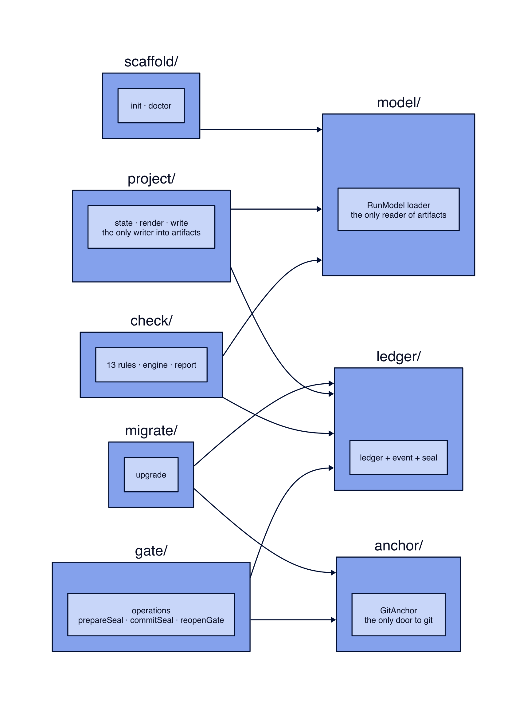

# Keel

**A mechanically-gated workflow for building software with AI agents — from problem statement to shipped, reviewed code.**

[](https://github.com/sakhujarohan/keel/actions/workflows/ci.yml)
[](LICENSE)


`v2.0.0-alpha` · not yet on npm — run from source (below)

Keel is a repeatable lifecycle — requirements → high-level design → stack selection → low-level design → task breakdown → build/test → review — with a human sign-off gate at every transition. **v1** is the methodology: prompts, templates, and slash commands any agent can follow. **v2** (this repo, `packages/`) makes the gates *mechanical*: a hash-anchored ledger records every sign-off, and `keel check` blocks a design that ran ahead of its gate or a seal that's been tampered with. v2 was built entirely under Keel's own process — [`specs/keel-v2/`](specs/keel-v2/) is the run, and CI runs `keel check` against this repository on every push: the "zero blocking findings" claim below is re-verified live, not just written down.

---

## 60-second quick start

```sh
git clone https://github.com/sakhujarohan/keel.git
cd keel && npm install
```

The CLI isn't published yet (see [Status](#status--roadmap)), so build it and link it as a real
`keel` command on your `PATH`:

```sh
npm run build
(cd packages/cli && npm link)
```

Do this rather than a shell alias: `keel init` wires a Claude Code hook (`.claude/settings.json`)
that runs `keel check --require <gate>` in a non-interactive subprocess — one that never sources
your shell's rc file, so an alias is invisible to it. `npm link` puts a real `PATH` entry in place,
which every subprocess sees, including that one. (`keel doctor` has a "keel on PATH" probe that
catches this if you skip it — see below.)

Point it at any git repo — this one or a project of your own:

```sh
cd ~/some-project        # or stay right here to try it on this repo
keel init                 # scaffold keel.yaml, templates, hooks, and the agent operating
                           # context (AGENTS.md, workflow/, principles.md, …) — never overwrites
keel run new checkout     # start a run under specs/checkout/
# … write specs/checkout/requirements.md, commit it …
keel gate pass G1 --run checkout --artifact specs/checkout/requirements.md
keel check                # verify the whole repo against the rule catalog
```

**Keel is agent-first: `keel init` scaffolds everything an agent needs by default.** Open the repo
you just `keel init`'d in Claude Code and run `/kickoff` — the slash commands, `AGENTS.md`,
`workflow/lifecycle.md`, `principles.md`, and the rest all arrived with `init`, so this works in
*any* project, not just this one. Any other agent (Codex, Cursor, Aider, Gemini): open the
project's `AGENTS.md` and follow `workflow/lifecycle.md` — it has no Claude-specific logic. Don't
want the agent bundle (a CI-only or CLI-only install)? `keel init --no-agent-context` skips it and
writes only `keel.yaml`, `templates/`, and the hooks.

## Seeing it work

Real, unedited output from the sequence above, run against a fresh repo — every command below is
literally reproducible, not abridged into working:

```
$ keel init
  ✓ keel.yaml
  ✓ templates/…            (12 files)
  ✓ .claude/settings.json
  ✓ .git/hooks/prepare-commit-msg
  ✓ .git/hooks/pre-push
  ✓ AGENTS.md, CLAUDE.md, GEMINI.md, principles.md
  ✓ workflow/…             (2 files)   profiles/…   (4 files)   tools/…   (2 files)
  ✓ skills/…               (2 files)
  ✓ .claude/commands/…     (12 files)  .claude/agents/reviewer.md

next: keel run new <name>

$ keel run new checkout
  ✓ specs/checkout/context.md
  ✓ specs/checkout/STATUS.md

# … write specs/checkout/requirements.md …
$ git add -A && git commit -m "draft checkout requirements"

$ keel gate pass G1 --run checkout --artifact specs/checkout/requirements.md --yes
sealing:
  run       checkout
  gate      G1
  artifact  specs/checkout/requirements.md
  hash      0412277efdb6
  actor     Ada Lovelace <ada@example.com>
  commit    2278e02

G1 sealed ✓
```

Sealing flips the artifact's frontmatter to `signed-off` and re-derives `STATUS.md` — that's a real
write to the working tree, so it needs a commit of its own before the seal is "the record":

```
$ git add -A && git commit -m "seal G1"
```

Now someone edits the sealed file without re-confirming it:

```
$ keel check --run checkout --format agent
WARN KC-10 specs/checkout/STATUS.md: The Now block shows G1 as signed off, but no seal
     in the ledger backs it — run: keel status --run checkout
BLOCK KC-09 specs/checkout/requirements.md: G1 was sealed at different content than
     specs/checkout/requirements.md now holds — restore the sealed content, or
     re-confirm with your human and run: keel gate reopen G1 --run checkout

BLOCKED: G1 was sealed at different content than specs/checkout/requirements.md now holds …
$ echo $?
1
```

Restore the exact bytes that were sealed, and it heals with no cleanup step:

```
$ git checkout -- specs/checkout/requirements.md
$ keel check --run checkout
0 blocking · 2 warning(s)
$ echo $?
0
```

*(The 2 warnings are `KC-13` — the two commits above carry no `Agent-*` attribution trailer,
because they were made by a human typing `git commit` directly rather than through an agent with
the hook's environment set. That's exactly what the rule is supposed to catch — [see it live in
this repo's own CI](https://github.com/sakhujarohan/keel/actions/workflows/ci.yml), which runs
`keel check` against itself on every push.)*

## How it works


<details>
<summary>Diagram source (D2)</summary>

```d2
vars: {
  d2-config: {
    theme-id: 8
  }
}

direction: right

agent: "Agent\nClaude Code · Cursor · Codex" { shape: person }
human: "Human" { shape: person }
ci: "CI\nGitHub Action" { shape: cloud }

cli: "keel CLI\nverification only — never authors content"

repo: "Your repository" {
  specs: "specs/<run>/\nrequirements · hld · lld · tasks …"
  ledger: ".keel/gates.jsonl\nappend-only, hash-anchored" { shape: cylinder }
  manifest: "keel.yaml"
}

agent -> cli: "phase skill blocked until\nits gate is sealed"
human -> cli: "gate pass — prints the seal,\nthen confirms before writing"
ci -> cli: "check --ci on every PR"
cli -> repo.specs
cli -> repo.ledger
cli -> repo.manifest
```

</details>

A gate isn't "sealed" because a file says `status: signed-off` — it's sealed because
`.keel/gates.jsonl` has a line whose hash matches that file's exact working-tree content, right now.
Edit the file after signing it, and the seal breaks the instant `keel check` runs — not at the next
review, not when someone happens to notice.

That diagram is behavior; this one is structure — `packages/core`'s actual module boundaries,
matching what shipped:



<details>
<summary>Diagram source (D2)</summary>

```d2
vars: {
  d2-config: {
    theme-id: 8
  }
}

direction: right

model: "model/" {
  loader: "RunModel loader\nthe only reader of artifacts"
}
anchor: "anchor/" {
  git: "GitAnchor\nthe only door to git"
}
ledgerdir: "ledger/" {
  led: "ledger + event + seal"
}
gatedir: "gate/" {
  ops: "operations\nprepareSeal · commitSeal · reopenGate"
}
checkdir: "check/" {
  rules: "13 rules · engine · report"
}
projectdir: "project/" {
  proj: "state · render · write\nthe only writer into artifacts"
}
scaffolddir: "scaffold/" {
  scaf: "init · doctor"
}
migratedir: "migrate/" {
  mig: "upgrade"
}

gatedir -> ledgerdir
gatedir -> anchor
checkdir -> model
checkdir -> ledgerdir
projectdir -> ledgerdir
projectdir -> model
migratedir -> ledgerdir
migratedir -> anchor
scaffolddir -> model
```

</details>

Each directory has exactly one job and one direction of dependency: `model/` is the only reader of
artifacts, `project/` the only writer, `anchor/` the only thing that ever shells out to git. That's
not incidental — it's what makes the rules in `check/` pure functions over a frozen snapshot,
testable without touching a filesystem.

## Why it's built this way

The expensive failure in AI-assisted development is the agent that designs or codes before the
problem is locked, anchors on a partial reading, and produces work that has to be torn down. Keel's
gates make that failure structurally impossible: **no design before requirements are locked, no code
before the design is signed off** — and in v2, that rule is enforced by an exit code, not a
convention the agent might skip under a long context window.

It borrows proven ideas — versioned markdown specs, EARS-style acceptance criteria, an always-on
"constitution," dependency-ordered tasks, ADRs — and adds what most agent-facing frameworks lack:

| | Most agent workflows | Keel |
|---|---|---|
| Design layers | One merged "design" doc | HLD and LLD **separately gated**, with real diagrams |
| Tech choice | Assumed, or picked early | An explicit **Stack-Lock gate**, traced to a driver |
| Rigor | All-or-nothing | **Modular profiles** — toggle observability, security depth, etc. per concern |
| Sign-off | A chat message | A **hash-anchored ledger entry** that outlives the session |
| Spec fidelity | Trusted to the model | **Literal Mandates** checked against the design before code is written |

The interesting engineering problem underneath all of this is enforcement with no server: git *is*
the database, and every guarantee has to hold under a filesystem's actual failure modes, not an
idealized one. A few of the edge cases that had to be handled correctly, not just happily:

- **Two git object formats, one hash.** A seal's hash must equal what `git hash-object` would print
  for those exact bytes — computed natively (`sha1("blob " + len + "\0" + bytes)`) to keep a
  subprocess off the hook's hot path, *and* falling back to a real `git hash-object` shell-out for
  `sha256` repositories, with the object format detected once and cached. (`anchor/git.ts`)
- **A write that can't half-happen.** The gate ledger is append-only; a single write to a file
  opened `O_APPEND` is atomic on POSIX below `PIPE_BUF` (4 KiB), so two seals racing each other
  interleave whole lines, never fragments — and the write is `fsync`'d before success is reported,
  because a sign-off has to survive a crash. (`ledger/ledger.ts`)
- **A symlink that might not be one.** Scaffolding `CLAUDE.md`/`GEMINI.md` as real symlinks to
  `AGENTS.md` uses `lstat`, not `stat`, so a *broken* symlink still correctly reads as "exists" and
  is never clobbered — and falls back to a plain file copy on platforms that refuse symlink creation
  outright. (`scaffold/init.ts`)
- **Every path, checked before it's trusted.** `--run`, `--artifact`, a run name, a `specs_dir` read
  from `keel.yaml` — each is resolved and verified to stay inside the repository root before any
  read, hash, or write; a traversal attempt throws immediately instead of touching the filesystem.
  (`model/paths.ts`)
- **Schemas that reject what they don't recognize.** The ledger's on-disk format and `keel.yaml`
  both parse through `zod` in strict mode — an unknown key is a bug to surface, never data to
  silently drop. (`ledger/event.ts`, `model/manifest.ts`)

The deepest bug of the build was found the same way most of the above were hardened: by actually
running the thing end-to-end, not trusting a unit test in isolation. Sealing hashed a gate's artifact
*before* writing its `signed-off` frontmatter — which changed the very file the seal was supposed to
protect. **Every gate sealed itself broken**, and no test caught it, because none of them ran both
operations in the same sequence against a real file. The fix, and two more bugs found the same
way — including one caught only by verifying this README's own quick start actually runs — are
recorded in full in [`plan-of-record.md`](specs/keel-v2/plan-of-record.md#the-load-bearing-bug-a-seal-that-broke-itself).

## What's in here

| Path | What it is |
|------|------------|
| `templates/` | A fill-in skeleton for every artifact. Always scaffolded by `keel init`. |

The rest, through `.claude/agents/` below, is the **agent operating context** — also scaffolded by
`keel init` into any target repo by default (`--no-agent-context` to skip just this part):

| Path | What it is |
|------|------------|
| `AGENTS.md` | The operating context for any agent. Read first. (`CLAUDE.md`, `GEMINI.md` symlink to it.) |
| `principles.md` | The constitution — always-on principles and named anti-patterns. |
| `workflow/lifecycle.md` | The full 8-phase gated playbook. |
| `workflow/fast-path.md` | Compressed overlay for time-boxed / rapid work. |
| `profiles/` | Rigor profiles and the concern-by-concern axes. |
| `tools/` | Optional toolchain setup — diagrams via the Kroki MCP. |
| `skills/` | Optional reusable capability modules (the `SKILL.md` pattern). |
| `.claude/commands/` | Claude Code slash commands for each phase. |
| `.claude/agents/` | Claude Code subagents (e.g. `reviewer` for Phase 8). |
| `packages/core` | The v2 engine: run model, gate ledger, 13-rule check engine, state projection, scaffold, migrator. |
| `packages/cli` | The `keel` binary — commander wiring, output formats, the exit-code contract. |
| `packages/action` | The GitHub Action (`check --ci`) for gating merges. |
| `specs/keel-v2/` | v2's own run — including [`plan-of-record.md`](specs/keel-v2/plan-of-record.md) (how it was designed vs. what shipped) and [`review-checklist.md`](specs/keel-v2/review-checklist.md) (the ship review). |
| `decisions/` | Architecture Decision Records. |
| `examples/` | Worked example runs — `ticket-booking` also doubles as `keel upgrade`'s acceptance test. |

## Status & roadmap

**v2.0.0-alpha**, `packages/cli` not yet published — clone, `npm run build`, and `npm link`, as above.
235 tests pass; Keel enforces its own run at 0 blocking findings.

See [`ROADMAP.md`](ROADMAP.md) for what's planned across v2.0.0 through v3, including the v2.0.x
patch list of documented, deliberate deferrals.

Issues and PRs welcome — this is a young project and still shaping its contribution process.

## License

[MIT](LICENSE) © 2026 Rohan Sakhuja
