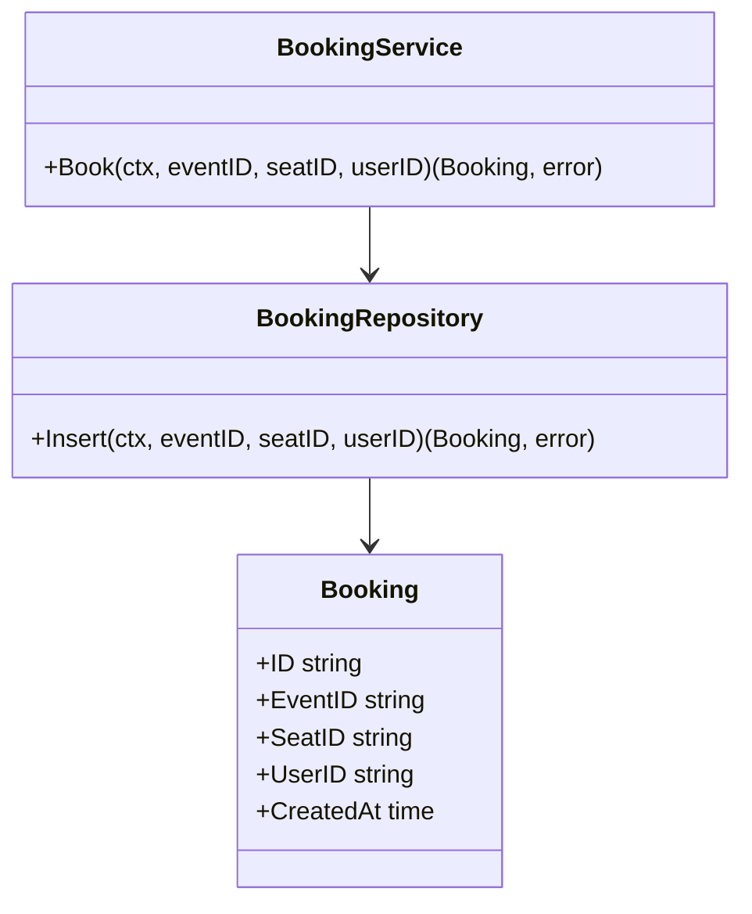

# LLD — book-seat

**Status:** [SIMULATED] G4 signed off · **Run:** ticket-booking · **Stack:** Go + Postgres (see `../../stack.md`)
**Serves requirements:** R1, R2, R3, R5, N1

## Class / Type Design



| Type | Responsibility | Serves |
|------|----------------|--------|
| BookingService | Orchestrates a booking; maps repo errors to domain errors | R1–R3 |
| BookingRepository | Single transactional insert; translates SQLSTATE | R1,R2,R3,R5 |
| Booking | Domain record | R1 |

## Interfaces / Contracts

```
POST /events/{eventId}/bookings
  body: { "seatId": "A12", "userId": "u_123" }
  → 201 { "bookingId": "bk_..." }
  → 409 { "error": "seat already booked" }
  → 404 { "error": "event or seat not found" }
```

## Concrete Data Model

`seats(event_id text, seat_id text, status text)` — PK `(event_id, seat_id)`
`bookings(id text PK, event_id text, seat_id text, user_id text, created_at timestamptz)`
 — **UNIQUE(event_id, seat_id)**; FK `(event_id, seat_id)` → `seats`

Invariant: at most one booking row per `(event_id, seat_id)`.

## Error Model

| Failure | Trigger | Result | Tx behavior |
|---------|---------|--------|-------------|
| seat already booked | UNIQUE violation (SQLSTATE 23505) | 409 | insert rolled back |
| event/seat missing | FK violation / no seat row | 404 | no write |
| other DB error | — | 500 | rolled back |

## Concurrency / Consistency

A single `INSERT` into `bookings`, guarded by `UNIQUE(event_id, seat_id)`. Concurrent inserts for the same seat → exactly one commits; the rest raise `23505` → `409`. No app-level lock. Satisfies **N1** and **R3** directly.

## G4 — LLD Sign-off
- [x] One-Line Test passes (buildable from this doc)
- [x] Types/contracts trace to requirements
- [x] Error model covers all failure modes
- [x] Concurrency requirement explicitly satisfied
- [x] [SIMULATED] human confirmed
