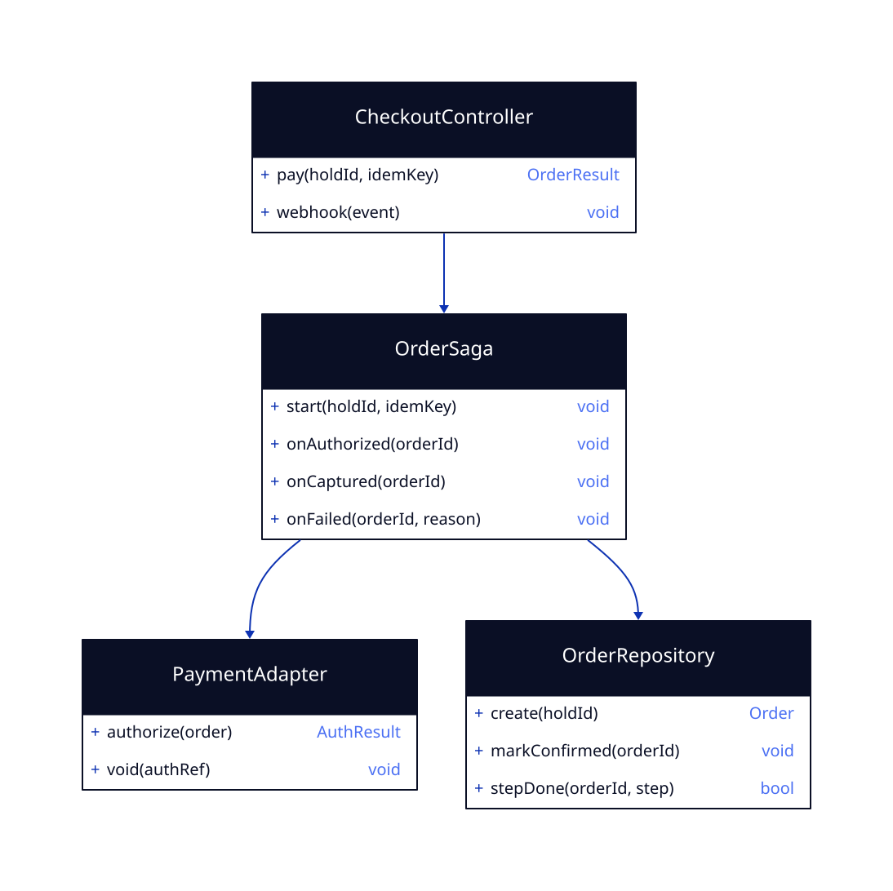

# LLD — checkout-saga

**Status:** [SIMULATED] G4 · Run: ticket-booking · Stack: Java/Spring + Postgres + Kafka + PSP adapter
**Delivers:** pay → confirm with release-on-failure (R6, R7) and exactly-once money under retries (R10, N8).

## What this feature does

Turns an active hold into a paid, confirmed order. It runs as a **saga**: create the order, authorize payment, wait for the capture webhook, then confirm and issue tickets. Every step is idempotent, and any failure or timeout **compensates** by releasing the hold and voiding the authorization — so a retry never double-charges and a failure never strands seats.

## Class design



- **CheckoutController** — `pay` starts the saga; `webhook` feeds PSP capture/decline events in.
- **OrderSaga** — the state machine: `start → authorized → captured → confirmed`, with compensation on `failed`/timeout.
- **PaymentAdapter** — wraps the PSP (idempotent authorize/capture, void).
- **OrderRepository** — persists the order and records which saga steps have run (so replays are no-ops).

## API

```
POST /orders            header: Idempotency-Key      body: { holdId }
  → 201 { orderId, status: "confirmed", tickets }
  → 402 { error: "payment failed" }     (hold released)
  → 409 { error: "hold expired" }

POST /orders/webhook    (PSP capture/decline; verified signature)   → 200
```

## Concrete data model

### `orders`
| Field | Type | Key / constraint |
|-------|------|------------------|
| id | uuid | PK |
| hold_id | uuid | FK → holds; UNIQUE (one order per hold) |
| user_id | text | NOT NULL |
| status | text | pending · authorized · confirmed · failed |
| total_cents | bigint | integer minor units |

### `payments`
| Field | Type | Key / constraint |
|-------|------|------------------|
| id | uuid | PK |
| order_id | uuid | FK → orders |
| psp_ref | text | the provider's reference |
| status | text | authorized · captured · voided · declined |

### `saga_steps` (idempotency / replay safety)
| Field | Type | Key / constraint |
|-------|------|------------------|
| order_id | uuid | PK part |
| step | text | PK part — authorize · capture · confirm · compensate |
| done_at | timestamptz | set once; a present row means "already done" |

## How exactly-once is guaranteed

- Each saga step checks `saga_steps` for `(order_id, step)` before acting; a present row makes the step a no-op, so retries and at-least-once Kafka redelivery are safe.
- `orders.hold_id UNIQUE` means a hold can only ever produce one order.
- On decline/timeout the saga runs **compensation**: release the hold (via `seat-hold`) and void the authorization through the PSP.

## Error model

| Failure | Trigger | Result | Behavior |
|---------|---------|--------|----------|
| Payment declined | PSP decline | 402 | compensate: release hold |
| Capture webhook never arrives | timeout | — | timeout job compensates; reconciliation sweeps stragglers |
| Hold expired before pay | hold not active | 409 | no charge |
| Duplicate `pay` | idem-key present | return existing order | no double-charge |

## G4 — LLD Sign-off
- [x] Saga steps + compensation fully specified; exactly-once spelled out
- [x] Schema shows order/payment/step state
- [x] Handles the never-arriving webhook (timeout + reconciliation)
- [x] [SIMULATED] human confirmed
