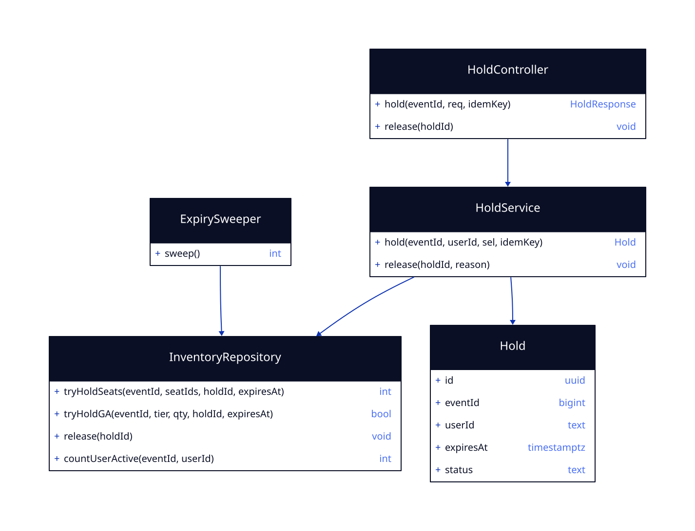

# LLD — seat-hold

**Status:** [SIMULATED] G4 · Run: ticket-booking · Stack: Java/Spring + Postgres + Redis
**Delivers:** the no-oversell hold (R4, R5), hold expiry (R7), per-user purchase limits (R8) — the system's hard correctness invariant (N1, N4).

## What this feature does

An admitted buyer asks to hold specific seats (reserved) or a quantity (general admission). The hold is **all-or-nothing** and is the single place that guarantees a seat is never held twice. Holds carry a 10-minute expiry; a sweeper plus lazy checks release expired ones. A per-user, per-event limit caps hoarding.

## Class design



- **HoldController** — the HTTP surface: place a hold, release a hold. Validates the request and the admission token, then delegates.
- **HoldService** — orchestrates one hold attempt: checks the purchase limit, performs the all-or-nothing reservation, sets the expiry, and records the idempotency key.
- **InventoryRepository** — the only code that touches inventory rows; every method is a single atomic statement (see *How correctness is guaranteed*).
- **ExpirySweeper** — a scheduled job that releases holds past their `expires_at`.
- **Hold** — the record: who holds what, until when, and in what state.

## API

```
POST /events/{eventId}/holds        header: Idempotency-Key
  body: { "seatIds": ["A12","A13"] }       (reserved)
      | { "tier": "GA", "quantity": 2 }    (general admission)
  → 201 { holdId, expiresAt, items }
  → 409 { error: "seat(s) unavailable", unavailable: ["A12"] }
  → 409 { error: "purchase limit reached" }
  → 404 { error: "event not found" }

DELETE /holds/{holdId}   → 204    (idempotent release)
```

## Concrete data model

### `holds`
| Field | Type | Key / constraint |
|-------|------|------------------|
| id | uuid | PK |
| event_id | bigint | FK → events; part of the partition key |
| user_id | text | NOT NULL |
| status | text | active · released · converted |
| expires_at | timestamptz | NOT NULL |
| idem_key | text | UNIQUE — makes the request idempotent |

### `hold_seats`
| Field | Type | Key / constraint |
|-------|------|------------------|
| hold_id | uuid | FK → holds |
| event_id | bigint | part of the uniqueness rule |
| seat_id | text | the seat being held |
| released_at | timestamptz | NULL while active |

**`UNIQUE(event_id, seat_id) WHERE released_at IS NULL`** — the guard that makes a double-hold physically impossible.

### `ga_inventory`
| Field | Type | Key / constraint |
|-------|------|------------------|
| event_id | bigint | PK part |
| tier | text | PK part |
| capacity | int | NOT NULL |
| remaining | int | CHECK (remaining >= 0) |

### `user_event_counter`
| Field | Type | Key / constraint |
|-------|------|------------------|
| event_id | bigint | PK part |
| user_id | text | PK part |
| count | int | enforces the per-user limit |

Indexes: `hold_seats(event_id, seat_id)` (the partial-unique index above); `holds(expires_at)` for the sweeper.

## How correctness is guaranteed (concurrency)

- **Reserved seats:** each seat is inserted into `hold_seats` under the partial-unique active-hold index. When two buyers race for the same seat, the database lets exactly one insert win; the loser gets a unique violation, which the repository maps to a `409`. The whole hold is one transaction — if any seat in the batch is lost, the entire hold rolls back (no partial holds). *This is what satisfies N1 and R5.*
- **General admission:** `UPDATE ga_inventory SET remaining = remaining - :q WHERE remaining >= :q`. It affects zero rows when there isn't enough left, which becomes a `409`; `remaining` can never go negative.
- **Expiry:** the hold's `expires_at` is the source of truth. The sweeper releases expired holds, and any availability read ignores a hold past its expiry — so a crash can't strand inventory. *This satisfies N4 and R7.*
- **Purchase limit:** checked and incremented in the same transaction via `user_event_counter`. *Satisfies R8.*

## Error model

| Failure | Trigger | Result | Transaction |
|---------|---------|--------|-------------|
| Seat already held/sold | partial-unique violation | 409 + which seats | whole hold rolls back |
| GA sold out | guarded decrement hits 0 rows | 409 | rollback |
| Over purchase limit | counter ≥ limit | 409 | rollback |
| Duplicate request | `idem_key` already present | return the original hold | no new hold |
| Event missing | no event row | 404 | no write |

## G4 — LLD Sign-off
- [x] One-Line Test: a builder could implement this from this doc alone
- [x] Concrete schema shows exactly how data is stored
- [x] The no-oversell invariant is explicitly guaranteed, with the race spelled out
- [x] Error model covers every failure mode
- [x] [SIMULATED] human confirmed
