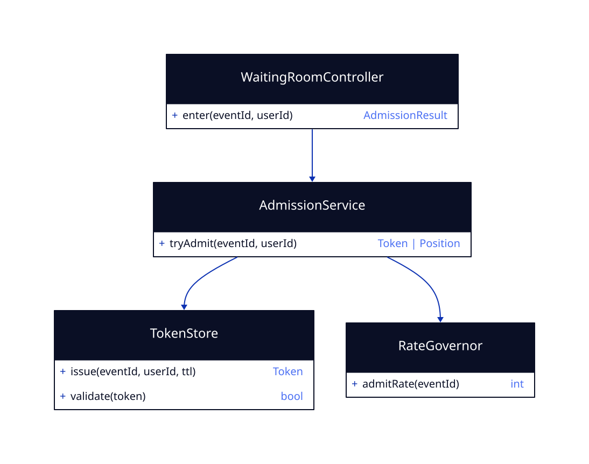

# LLD — waiting-room

**Status:** [SIMULATED] G4 · Run: ticket-booking · Stack: Java/Spring + Redis
**Delivers:** paced admission to the on-sale (R3) so the core never tips over (N2, N6).

## What this feature does

At on-sale, every buyer enters the waiting room first. The room admits people at a rate the core can actually serve, handing each admitted buyer a short-lived **token** they must present to place a hold. Everyone else waits and is told their position. This sheds and paces load *before* it reaches inventory.

## Class design



- **WaitingRoomController** — `enter`: returns either an admission token or a queue position.
- **AdmissionService** — decides admit-vs-queue using the current allowed rate.
- **RateGovernor** — computes the admit rate per event from core saturation (so admission backs off when the core is busy).
- **TokenStore** — issues and validates time-boxed tokens (Redis, with TTL).

## API

```
POST /events/{eventId}/waiting-room/enter   (userId from gateway)
  → 200 { admitted: true, token, expiresAt }
  → 200 { admitted: false, position, retryAfterSec }
```

## State (Redis)

- **Admission counter / token bucket per event** — paces how many tokens are handed out per interval (driven by `RateGovernor`).
- **Tokens** — `token → {eventId, userId}` with a TTL (e.g. 2 min); `seat-hold` calls `TokenStore.validate` before accepting a hold. Redis is fine here because a lost token only costs a re-queue — it can't cause an oversell (that guard lives in `seat-hold`).

## Notes & error model

- The admit rate is configurable per event and adapts to core saturation (target < 70%).
- An expired/invalid token at hold time → `401`, the buyer re-enters the room.
- Redis unavailability degrades to a conservative fixed admit rate rather than letting an unbounded crowd through.

## G4 — LLD Sign-off
- [x] Admission is paced and adaptive; tokens are time-boxed
- [x] Correctness does not depend on Redis (it only paces; the oversell guard is in seat-hold)
- [x] [SIMULATED] human confirmed
