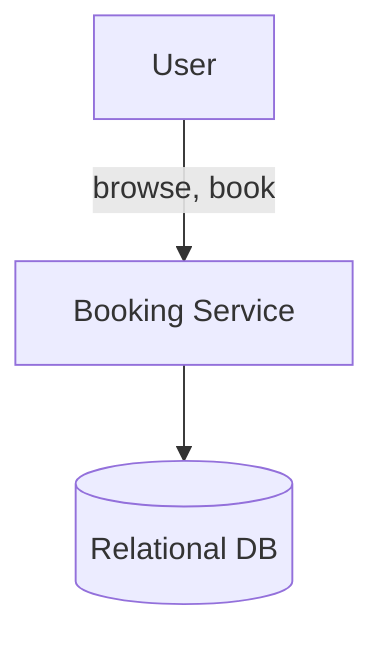
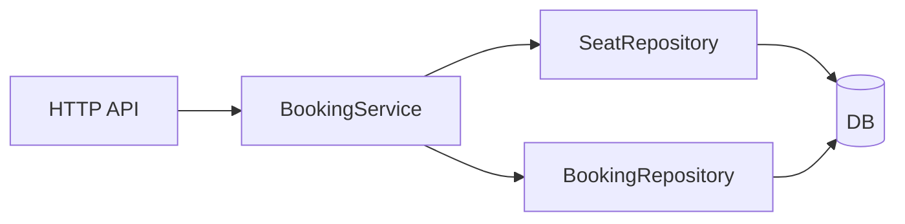
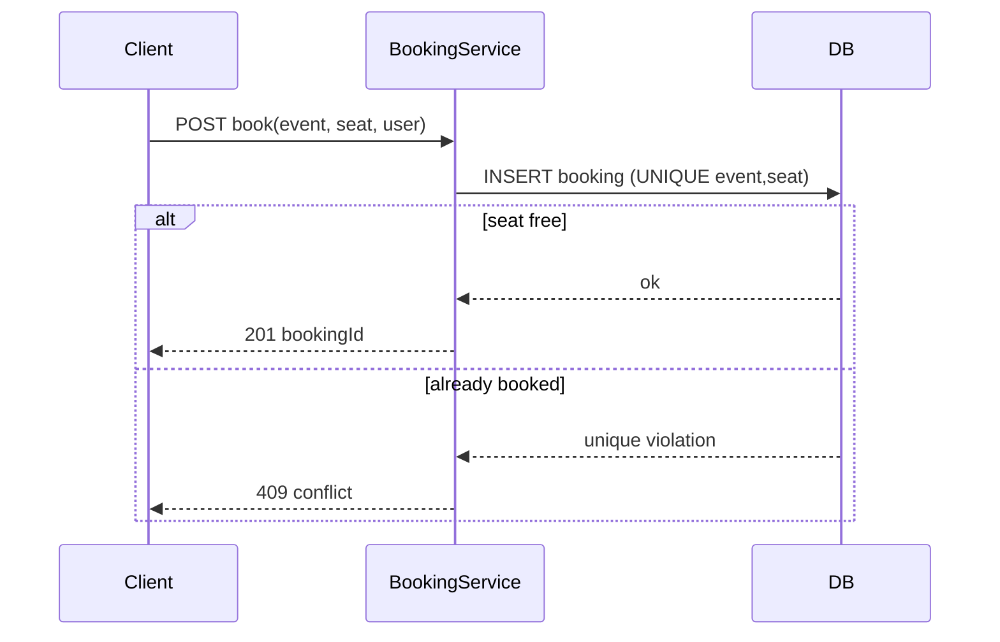
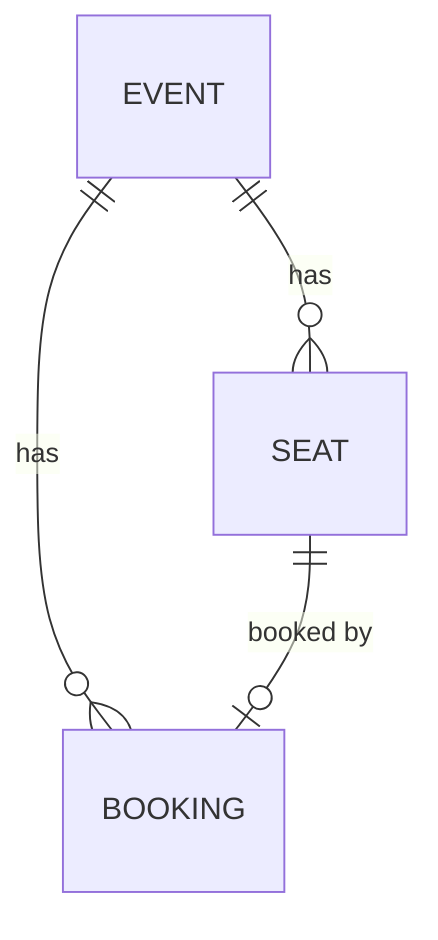

# High-Level Design — ticket-booking

**Status:** LOCKED ([SIMULATED] G2) · **Requirements:** see `requirements.md`

## Critical Design Questions

### Q1 — How is double-booking prevented under concurrency? (serves N1, R3)
- **Options:** (a) pessimistic row lock on the seat (`SELECT … FOR UPDATE`); (b) optimistic version/CAS on seat status; (c) a DB **UNIQUE constraint** on `bookings(event_id, seat_id)` + a single transactional insert.
- **Decision:** (c). The database arbitrates the race — exactly one writer commits, the rest get a constraint violation mapped to `409`.
- **Why:** Simplest correct option. No app-level lock coordination, correct across multiple service instances, and the invariant is enforced by the store itself. (→ ADR `0001`)

## C4 Level 1 — Context

## C4 Level 2/3 — Containers & Components

| Component | Responsibility | Serves |
|-----------|----------------|--------|
| HTTP API | Request/response, validation | R1–R5 |
| BookingService | Booking transaction, conflict mapping | R1–R3 |
| SeatRepository | Seat reads / availability | R4 |
| BookingRepository | Conditional booking insert | R1–R3 |

## Key Flow — Book a seat

## Conceptual Data Model

## G2 — HLD Sign-off
- [x] Every requirement served by a component
- [x] Critical question answered with rationale
- [x] Diagrams consistent
- [x] [SIMULATED] human confirmed shape
