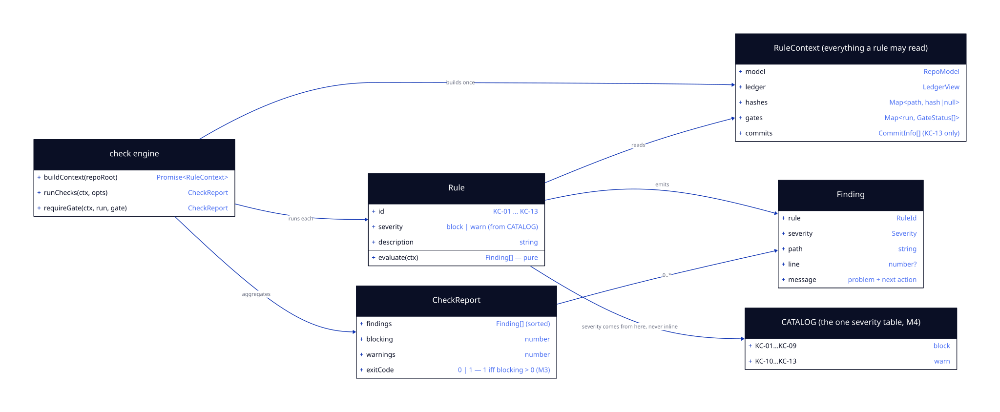

# LLD — check-engine

**Status:** DRAFT → (signed off after G4) · **Run:** keel-v2 · **Stack:** see `../../stack.md`
**Serves requirements:** R3 (check a repo), R4 (assert a gate), R7 (seal breaks surface as findings) · **Mandates:** M3, M4 · **NFRs:** N1, N6

The engine is the product: it turns a loaded repository into a verdict. Its two hard rules come straight from the mandates — **severity lives in exactly one table** (M4), and **the exit code is a pure function of whether any block-severity finding exists** (M3). Everything else is thirteen small, pure functions.

---

## Class / Type Design



<details><summary>diagram source (d2, shape: class)</summary>

```d2
direction: right

ctx: "RuleContext  (everything a rule may read)" {
  shape: class
  model: RepoModel
  ledger: LedgerView
  hashes: "Map<path, hash|null>"
  gates: "Map<run, GateStatus[]>"
  commits: "CommitInfo[]  (KC-13 only)"
}

rule: "Rule" {
  shape: class
  id: "KC-01 … KC-13"
  severity: "block | warn  (from CATALOG)"
  description: string
  "evaluate(ctx)": "Finding[]   — pure"
}

catalog: "CATALOG  (the one severity table, M4)" {
  shape: class
  "KC-01…KC-09": block
  "KC-10…KC-13": warn
}

finding: "Finding" {
  shape: class
  rule: RuleId
  severity: Severity
  path: string
  line: "number?"
  message: "problem + next action"
}

engine: "check engine" {
  shape: class
  "+buildContext(repoRoot)": "Promise<RuleContext>"
  "+runChecks(ctx, opts)": CheckReport
  "+requireGate(ctx, run, gate)": CheckReport
}

report: "CheckReport" {
  shape: class
  findings: "Finding[] (sorted)"
  blocking: number
  warnings: number
  exitCode: "0 | 1   — 1 iff blocking > 0  (M3)"
}

engine -> ctx: builds once
engine -> rule: "runs each"
rule -> ctx: reads
rule -> finding: emits
rule -> catalog: "severity comes from here, never inline"
engine -> report: aggregates
report -> finding: "0..*"
```

</details>

| Type | Responsibility | Serves |
|------|----------------|--------|
| `RuleContext` | Everything a rule may read, loaded **once** per invocation. A rule that needs something absent here is asking for the wrong thing. | N1 |
| `Rule` | `{ id, severity, description, evaluate }`. `evaluate` is pure: context in, findings out. No I/O, no clock, no git. | N1, M4 |
| `CATALOG` | The single ordered list of rules. **The only place a severity appears.** | M4 |
| `Finding` | Rule id, severity, path, optional line, and a message shaped as *problem + next action*. | N6 |
| `CheckReport` | Sorted findings, counts, and the exit code. | M3 |
| `buildContext` | The one impure step: loads model, ledger, hashes, gate statuses (and commits only when a rule needs them). | R3 |
| `runChecks` / `requireGate` | Whole-repo check, and the single-gate assertion the agent hook calls. | R3, R4 |

## Interfaces / Contracts

```ts
export type Severity = "block" | "warn";

export type RuleId =
  | "KC-01" | "KC-02" | "KC-03" | "KC-04" | "KC-05" | "KC-06" | "KC-07"
  | "KC-08" | "KC-09" | "KC-10" | "KC-11" | "KC-12" | "KC-13";

export interface Finding {
  rule: RuleId;
  severity: Severity;
  /** Repo-relative path the reader should open. */
  path: string;
  line?: number;
  /** One sentence: what is wrong, then the single next action (N6). */
  message: string;
}

export interface CommitInfo {
  sha: string;
  subject: string;
  trailers: Record<string, string>;
}

export interface RuleContext {
  readonly model: RepoModel;
  readonly ledger: LedgerView;
  /** Working-tree blob id per artifact path; null when the file is gone. */
  readonly hashes: ReadonlyMap<string, string | null>;
  readonly gates: ReadonlyMap<string, GateStatus[]>;   // keyed by run name
  /** Loaded only when a rule in the active set needs it (KC-13). */
  readonly commits: readonly CommitInfo[];
}

export interface Rule {
  id: RuleId;
  severity: Severity;
  description: string;
  evaluate(ctx: RuleContext): Finding[];
}

/** The single severity table. Adding a rule anywhere else is a bug. */
export const CATALOG: readonly Rule[];

export interface CheckOptions {
  /** Limit to one run. */
  run?: string;
  /** Treat "no keel.yaml" as an error rather than a no-op (A6). */
  strict?: boolean;
}

export interface CheckReport {
  findings: Finding[];
  blocking: number;
  warnings: number;
  /** 1 if and only if blocking > 0 (M3). Warnings never move this. */
  exitCode: 0 | 1;
  /** True when the repo has no keel.yaml and strict was not set (A6). */
  notAKeelRepo: boolean;
}

export function buildContext(args: {
  repoRoot: string;
  anchor: GitAnchor;
  needCommits?: boolean;
}): Promise<RuleContext>;

export function runChecks(ctx: RuleContext, opts?: CheckOptions): CheckReport;

/**
 * The hook path (R4): assert one gate is sealed at the artifact's current content.
 * Runs KC-09 semantics only — it does not evaluate the whole catalog, because a hook must be
 * fast and must answer exactly one question.
 */
export function requireGate(args: {
  ctx: RuleContext;
  run: string;
  gate: Gate;
  /** Narrow to one feature's G4/G5 when the phase is feature-scoped. */
  feature?: string;
}): CheckReport;
```

## The rule catalog

Severities are fixed by M4: **KC-01…KC-09 block, KC-10…KC-13 warn.**

| ID | Rule | Reads | Finding is raised when |
|----|------|-------|------------------------|
| KC-01 | Artifacts parse and validate | `model.diagnostics` | any frontmatter/manifest/table diagnostic exists — the loader's diagnostics become findings here, which is where they finally surface |
| KC-02 | Phase order | `gates`, `model` | an artifact exists whose upstream gate is not sealed (no `hld.md` before G1, no `lld.md` before G3, no `tasks.md` before G5) |
| KC-03 | Assumptions confirmed | `model.…assumptions`, `gates` | G1 is sealed while any assumption is still `proposed` |
| KC-04 | Literal Mandates declared | `model.…mandates`, `mandatesExplicitNone` | the Mandates table is neither populated nor an explicit `None` |
| KC-05 | Requirement coverage | `model.…requirements`, `hld.featureList` | a requirement ID appears in no feature's `delivers` |
| KC-06 | Feature coverage | `hld.featureList`, `features` | an HLD-declared feature has no `lld.md` and no deferral note |
| KC-07 | Mandate coverage | `mandates`, `features[].specCheck` | a mandate has no row in a feature's spec-check (checked per feature that has a spec-check) |
| KC-08 | Task graph | `features[].tasks` | a task lacks a definition of done or requirement IDs · a dependency names an unknown task · the wave graph has a cycle · two tasks in one wave declare the same file |
| KC-09 | Seal integrity | `gates` | a gate's seal is `broken`, or a gate is `blockedBy` an earlier unsealed gate |
| KC-10 | STATUS projection | `statusFile`, `gates` | the `Now` block disagrees with the state derived from frontmatter + ledger |
| KC-11 | Referential integrity | all ID-bearing rows | an ID reference names nothing that exists (`delivers`, `dependsOn`, task `requirements`, spec-check mandate refs) |
| KC-12 | Template drift | `manifest`, `templates/VERSION` | `keel.yaml`'s `templates_version` disagrees with the installed templates — **narrowed, see below** |
| KC-13 | Commit attribution | `commits` | a commit touching a run's artifacts carries no `Agent-*`/`Keel-*` trailer and no `Human-Authored` marker |

**KC-12 is deliberately narrowed.** The plan describes it as "self-consistency of the framework docs — phase numbers and versions in `AGENTS.md`/`README` match the manifest". That is unimplementable in a general repository: a user's repo has no `AGENTS.md` phase table to compare against, and prose-version matching is guesswork. It is implemented instead as **template drift**: `keel.yaml.templates_version` versus the `templates/VERSION` marker written by `init`/`upgrade`, skipping silently when templates are not installed. This catches the real failure the plan was aiming at (docs and tooling out of step after an upgrade) with a mechanical test rather than prose parsing. Recorded as an interpretation for G5.

**KC-13 needs one addition to `gate-ledger`:** `GitAnchor` gains `recentCommits(limit)` returning `{ sha, subject, trailers }`. Additive; no existing method changes.

**The three orphaned ledger diagnostics get a home** (carried forward from gate-ledger's G5): `ledger-line-malformed`, `ledger-entry-invalid` and `ledger-unknown-run` are surfaced by **KC-09**, since they mean the seal record itself is unreliable. Without this they would be produced and never seen.

## Concrete Data Model

None — the engine owns no persistent state. Its inputs are `RepoModel` and `LedgerView`; its output is a `CheckReport` that lives only as long as the process.

**Finding ordering** (part of N1): sort by `path`, then `line ?? 0`, then `rule`. Two runs over one tree produce byte-identical output, which is what makes findings diffable in CI.

## Error Model

| Failure | Trigger | Result | Behaviour |
|---------|---------|--------|-----------|
| No `keel.yaml` | manifest absent | `CheckReport{ notAKeelRepo: true, exitCode: 0 }` (A6) | safe to add the CI action org-wide |
| No `keel.yaml`, `--strict` | as above with the flag | `KeelError` → exit 2 | the caller opted into strictness |
| Broken `keel.yaml` | manifest present but invalid | KC-01 block finding → exit 1 | "broken keel repo" ≠ "not a keel repo" |
| Unreadable file / bad root | filesystem | `KeelError` from the loader → exit 2 | environment failures never masquerade as findings (M3's iff stays intact) |
| Git missing | `buildContext` needs the anchor | `KeelError{ENV_NO_GIT}` → exit 2 | — |
| A rule throws | a bug in a rule | the throw propagates → exit 2 | **deliberate**: a crashing rule must never be reported as "no findings". A silent pass is the one outcome an enforcement tool may not have |
| `requireGate` on an unknown run/gate | typo or missing artifact | one block finding naming the gate → exit 1 | the hook stops the agent rather than waving it through |

## Concurrency / Consistency Notes

- **Rules are pure.** `evaluate(ctx) => Finding[]` — no filesystem, no git, no clock, no environment, no mutation of the context. This is what makes fixture testing exhaustive and CI output stable, and it is enforced structurally: the context is deep-frozen before the first rule runs.
- **One load per invocation.** `buildContext` performs every read up front; rules never trigger I/O, so total cost is bounded by the loader plus hashing.
- **Exit code is derived last** from the finding list, in one place, as `blocking > 0 ? 1 : 0`. No rule and no command may set it — that is how M3's *iff* is kept true by construction rather than by discipline.
- **The hook path is deliberately narrow.** `requireGate` answers one question against the ledger and one hash; it does not run the catalog. This is the measured response to the N3 finding in `run-model` — the full check is for `keel check` and CI, not for every intercepted tool call.
- **Commits are loaded lazily.** `buildContext({ needCommits })` — only KC-13 needs git history, so the common path never pays for it.

## Traceability

| Requirement / Mandate | Where satisfied |
|---|---|
| R3 check a repo | `buildContext` + `runChecks` over `CATALOG` |
| R4 assert a gate | `requireGate`, narrow by design |
| R7 seal breaks surface | KC-09, reading `GateStatus.seal` and `blockedBy` |
| M3 exit iff blocking | `CheckReport.exitCode` derived in one place from severities |
| M4 severities fixed | `CATALOG` is the only place a severity is written |
| N1 determinism | pure rules, frozen context, explicit finding sort |
| N6 agent-actionable | every `Finding.message` is problem + next action |
| A6 non-keel repos | `notAKeelRepo` + `strict` |

---

## G4 — LLD Sign-off

- [ ] One-Line Test passes: a builder could implement this from this doc alone
- [ ] Every type/contract traces to a requirement
- [ ] Error model covers every failure mode
- [ ] Concurrency/consistency requirements are explicitly satisfied
- [ ] **Human has confirmed the design before build**
