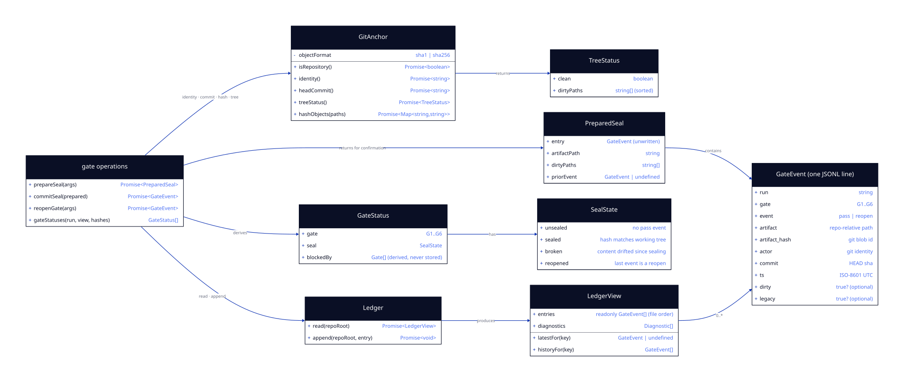

# LLD — gate-ledger

**Status:** LOCKED (G4 signed by Rohan, 2026-07-20, via `/spec-check` advance) · **Run:** keel-v2 · **Stack:** see `../../stack.md`
**Serves requirements:** R5 (seal), R6 (dirty-tree refusal), R7 (seal-break detection), R8 (reopen) · **Mandates:** M1, M2, M7, M9 · **NFRs:** N1, N2, N5

This is the feature that makes a sign-off *mean* something: an append-only, hash-anchored record that outlives the session it was made in. It owns two things and nothing else — **all git interaction** (`anchor`) and **the ledger** (`ledger`, `gate`). It writes no artifact content; the frontmatter projection that follows a gate event belongs to the `state-projection` feature (M6/A5).

> **Amendment 1 (2026-07-20, found during build) — the dirty-tree check ignores `.keel/`.**
> Sealing writes the ledger, which leaves `.keel/` uncommitted. Counting that as dirt meant the *second* gate of any session was always refused — the first seal poisoned the next. The exemption is scoped to Keel's own directory: the check exists to guarantee the **artifact** is committed and the seal anchors to a real commit, and the ledger is Keel's record rather than the work being signed. (git reports the whole directory as `.keel/` while untracked, so the test is by prefix, not by exact filename.)

> **Amendment 2 (2026-07-21, found by the CLI end-to-end test) — the seal hashes the *post-sign* content.**
> Two sealed decisions were in direct conflict: ADR 0002 verifies a seal against the working tree, while A5 has `gate pass` write `status: signed-off` into the artifact's frontmatter. Sealing the *pre-flip* content and then writing the flip broke the seal the instant it was created — every gate sealed itself broken. **Resolution:** `prepareSeal` hashes the artifact as it will read once signed (`applyArtifactState(raw, "signed-off", today)`), so the working tree matches the seal after the projection runs. This keeps M1 literally true — the stored hash is still `git hash-object` of the bytes that end up on disk — and makes "the signed content" mean exactly that. Consequence, now a property of the design: **a seal and its frontmatter projection are a pair.** `commitSeal` must be followed by `setArtifactState`; between them the seal reads broken, which `keel check` reports and re-running the pair repairs. The shared transform lives in `model/frontmatter-state.ts` so the hash and the write can never disagree by a byte.

---

## Class / Type Design



<details><summary>diagram source (d2, shape: class)</summary>

```d2
direction: right

anchor: "GitAnchor" {
  shape: class
  "+isRepository()": "Promise<boolean>"
  "+identity()": "Promise<string>"
  "+headCommit()": "Promise<string>"
  "+treeStatus()": "Promise<TreeStatus>"
  "+hashObjects(paths)": "Promise<Map<string,string>>"
  "-objectFormat": "sha1 | sha256"
}

tree: "TreeStatus" {
  shape: class
  clean: boolean
  dirtyPaths: "string[] (sorted)"
}

ledger: "Ledger" {
  shape: class
  "+read(repoRoot)": "Promise<LedgerView>"
  "+append(repoRoot, entry)": "Promise<void>"
}

view: "LedgerView" {
  shape: class
  entries: "readonly GateEvent[] (file order)"
  diagnostics: "Diagnostic[]"
  "+latestFor(key)": "GateEvent | undefined"
  "+historyFor(key)": "GateEvent[]"
}

event: "GateEvent  (one JSONL line)" {
  shape: class
  run: string
  gate: "G1..G6"
  event: "pass | reopen"
  artifact: "repo-relative path"
  artifact_hash: "git blob id"
  actor: "git identity"
  commit: "HEAD sha"
  ts: "ISO-8601 UTC"
  dirty: "true?  (optional)"
  legacy: "true?  (optional)"
}

seal: "SealState" {
  shape: class
  "unsealed": "no pass event"
  "sealed": "hash matches working tree"
  "broken": "content drifted since sealing"
  "reopened": "last event is a reopen"
}

status: "GateStatus" {
  shape: class
  gate: "G1..G6"
  seal: SealState
  blockedBy: "Gate[]  (derived, never stored)"
}

ops: "gate operations" {
  shape: class
  "+prepareSeal(args)": "Promise<PreparedSeal>"
  "+commitSeal(prepared)": "Promise<GateEvent>"
  "+reopenGate(args)": "Promise<GateEvent>"
  "+gateStatuses(run, view, hashes)": "GateStatus[]"
}

prepared: "PreparedSeal" {
  shape: class
  entry: "GateEvent (unwritten)"
  artifactPath: string
  dirtyPaths: "string[]"
  priorEvent: "GateEvent | undefined"
}

ops -> anchor: "identity · commit · hash · tree"
ops -> ledger: "read · append"
ops -> prepared: "returns for confirmation"
prepared -> event: contains
ledger -> view: produces
view -> event: "0..*"
anchor -> tree: returns
ops -> status: derives
status -> seal: has
```

</details>

| Type | Responsibility | Serves |
|------|----------------|--------|
| `GitAnchor` | The only place in the system that touches git: identity, HEAD, working-tree state, blob hashing. | M9, R5, R6 |
| `GateEvent` | One ledger line. Field set is fixed by M1 — **no field may be added**, including `feature`. | M1 |
| `Ledger` / `LedgerView` | Append one line; read all lines in **file order**; answer "what is the latest event for this key". | M1, M7, N2 |
| `SealState` | Whether a gate is unsealed, sealed, broken (content drifted) or reopened. | R7, R8 |
| `GateStatus` | A gate's seal plus `blockedBy` — the earlier gates that are not sealed. Derived at read time, never written. | R7 |
| `prepareSeal` / `commitSeal` | Split so the CLI can print exactly what is about to be sealed *before* anything is written (R5). | R5, R6 |
| `reopenGate` | Append a `reopen` event; history is never rewritten. | R8 |

## Interfaces / Contracts

```ts
// ---------- git ----------------------------------------------------------

export interface TreeStatus {
  clean: boolean;
  /** Repo-relative paths, sorted — shown verbatim in the refusal message (R6). */
  dirtyPaths: string[];
}

export interface GitAnchor {
  isRepository(): Promise<boolean>;
  /** "Name <email>" from git config. Asserted, not authenticated — see M9 and ADR 0002. */
  identity(): Promise<string>;
  headCommit(): Promise<string | null>;       // full sha; null in a repo with no commits (refused)
  treeStatus(): Promise<TreeStatus>;
  /** Blob ids for repo-relative paths, in one pass. */
  hashObjects(paths: string[]): Promise<Map<string, string>>;
}

export function createGitAnchor(repoRoot: string): GitAnchor;

// ---------- ledger -------------------------------------------------------

export type GateEventKind = "pass" | "reopen";

/** The M1 field set, exactly. Serialised in this key order for stable diffs. */
export interface GateEvent {
  run: string;
  gate: Gate;
  event: GateEventKind;
  artifact: string;        // repo-relative POSIX path — this is what identifies a per-feature gate
  artifact_hash: string;
  actor: string;
  commit: string;
  ts: string;              // ISO-8601, UTC, millisecond precision
  dirty?: true;            // present only when true (M2)
  legacy?: true;           // present only when true (M8, written by the upgrade feature)
}

/** Gates G4/G5 repeat per feature, so a key is (run, gate, artifact) — never a new field. */
export interface SealKey {
  run: string;
  gate: Gate;
  artifact: string;
}

export interface LedgerView {
  /** Every parsed entry, in file order. Order is position, never `ts` — clocks are not trusted. */
  readonly entries: readonly GateEvent[];
  readonly diagnostics: readonly Diagnostic[];
  latestFor(key: SealKey): GateEvent | undefined;
  historyFor(key: SealKey): readonly GateEvent[];
  /** Every key the ledger has ever seen for a run — the input to gate status. */
  keysFor(run: string): readonly SealKey[];
}

export const LEDGER_PATH = ".keel/gates.jsonl";      // M7

export function readLedger(repoRoot: string): Promise<LedgerView>;
export function appendGateEvent(repoRoot: string, entry: GateEvent): Promise<void>;

// ---------- seal state ---------------------------------------------------

export type SealState =
  | { kind: "unsealed" }
  | { kind: "sealed"; entry: GateEvent }
  | { kind: "broken"; entry: GateEvent; currentHash: string | null }  // null ⇔ artifact deleted
  | { kind: "reopened"; entry: GateEvent };

export function sealStateFor(args: {
  key: SealKey;
  view: LedgerView;
  /** Working-tree hash of the artifact; null when the file is gone. */
  currentHash: string | null;
}): SealState;

export interface GateStatus {
  gate: Gate;
  artifact: string;
  seal: SealState;
  /** Earlier gates that are not sealed. Empty ⇒ this gate stands on solid ground. */
  blockedBy: Gate[];
}

export const GATE_ORDER: readonly Gate[] = ["G1", "G2", "G3", "G4", "G5", "G6"];

/** Derives every gate's status for a run, including downstream invalidation (ADR 0002). */
export function gateStatuses(args: {
  run: string;
  view: LedgerView;
  hashes: Map<string, string | null>;    // artifact path → working-tree hash
}): GateStatus[];

// ---------- operations ---------------------------------------------------

export interface PreparedSeal {
  entry: GateEvent;             // not yet written
  dirtyPaths: string[];         // non-empty only under allowDirty
  priorEvent: GateEvent | undefined;
}

/**
 * Gathers everything a seal needs and validates it. Writes nothing — the CLI prints the
 * PreparedSeal, gets confirmation, then calls commitSeal (R5).
 * Throws GateRefusal when the tree is dirty and allowDirty is false (R6, M2).
 */
export function prepareSeal(args: {
  repoRoot: string;
  anchor: GitAnchor;
  run: string;
  gate: Gate;
  artifact: string;             // repo-relative
  allowDirty?: boolean;
  now?: () => Date;             // injected so tests are deterministic
}): Promise<PreparedSeal>;

export function commitSeal(args: {
  repoRoot: string;
  prepared: PreparedSeal;
}): Promise<GateEvent>;

export function reopenGate(args: {
  repoRoot: string;
  anchor: GitAnchor;
  run: string;
  gate: Gate;
  artifact: string;
  now?: () => Date;
}): Promise<GateEvent>;

export class GateRefusal extends Error {
  readonly reason:
    | "dirty-tree"
    | "not-a-repository"
    | "no-commit"          // amendment (G5 item 2) — a seal must anchor to a real commit
    | "artifact-missing"
    | "no-identity"
    | "already-sealed";
  readonly nextAction: string;
  readonly dirtyPaths?: string[];
}
```

**Hashing without a subprocess.** `artifact_hash` must be the value `git hash-object` produces (M1). That value is `sha1("blob " + byteLength + "\0" + bytes)`, which `hashObjects` computes natively — verified against `git hash-object` in a test over binary, empty, unicode and CRLF fixtures. This removes a process spawn from the hot path (see the N3 finding in `run-model/tasks.md`). If `git config extensions.objectFormat` is `sha256`, the anchor shells out to `git hash-object` instead; the ledger stores whatever git would.

## Concrete Data Model

### `.keel/gates.jsonl` (M7)

Append-only JSON Lines, committed to the repository, one `GateEvent` per line, keys serialised in the M1 order (`run, gate, event, artifact, artifact_hash, actor, commit, ts[, dirty][, legacy]`).

```jsonl
{"run":"keel-v2","gate":"G1","event":"pass","artifact":"specs/keel-v2/requirements.md","artifact_hash":"9f2c41a…","actor":"Rohan Sakhuja <rohansakhuja.work@gmail.com>","commit":"a4ffc19…","ts":"2026-07-13T11:42:03.001Z"}
{"run":"keel-v2","gate":"G4","event":"reopen","artifact":"specs/keel-v2/features/run-model/lld.md","artifact_hash":"41d0c77…","actor":"Rohan Sakhuja <rohansakhuja.work@gmail.com>","commit":"3e8b112…","ts":"2026-07-20T09:14:55.220Z"}
```

| Field | Type | Constraint |
|-------|------|------------|
| `run` | string | kebab-case; must name a run directory |
| `gate` | enum | `G1`–`G6` |
| `event` | enum | `pass` \| `reopen` |
| `artifact` | string | repo-relative POSIX path; non-empty; identifies the feature for G4/G5 |
| `artifact_hash` | string | 40 hex chars (sha1) or 64 (sha256); the blob id at seal time |
| `actor` | string | git identity, `Name <email>`; non-empty |
| `commit` | string | 40 hex chars, or `""` in a repo with no commits yet |
| `ts` | string | ISO-8601 UTC with milliseconds |
| `dirty` | `true` | present **only** when sealed over a dirty tree (M2); never `false` |
| `legacy` | `true` | present **only** for entries backfilled by `keel upgrade` (M8) |

**Invariants**
- **Append-only (N2).** No code path rewrites, reorders or deletes a line. Reopen is a new line.
- **Order is file position**, not `ts`. A skewed clock cannot reorder history.
- **Last-event-wins** per `SealKey`: the seal is `pass` only if the latest event for the key is a `pass`.
- **Field set is closed (M1).** Unknown keys on read → `ledger-entry-invalid` diagnostic; the entry is ignored for sealing but the line is preserved on disk.
- `.keel/` is created on first append with mode 0755; the file with 0644.

### Diagnostics added to the shared `DiagCode` union

This feature extends the union that `run-model` owns (additive; no existing code changes):

| Code | Raised when |
|------|-------------|
| `ledger-line-malformed` | a line is not valid JSON — reported with its 1-based line number, then skipped |
| `ledger-entry-invalid` | valid JSON but fails the `GateEvent` schema (missing/extra/ill-typed field) |
| `ledger-unknown-run` | an entry names a run with no directory — the ledger outlived its run |

## Error Model

| Failure | Trigger | Result | Behaviour |
|---------|---------|--------|-----------|
| Not a git repository | `.git` absent / `git rev-parse` fails | `GateRefusal{reason:"not-a-repository"}` → exit 2 | nothing written |
| Dirty working tree, no flag | `treeStatus().clean === false`, **ignoring `.keel/`** (amendment 1) | `GateRefusal{reason:"dirty-tree", dirtyPaths}` → exit 2, message lists the paths and offers `--allow-dirty` (R6, M2) | nothing written |
| Dirty tree with `--allow-dirty` | same, flag set | proceeds; entry carries `dirty: true` (M2) | one line appended |
| Repository has no commits | `HEAD` resolves to nothing | `GateRefusal{reason:"no-commit"}` → exit 2, next action: make an initial commit, then seal | nothing written. M1 would permit `commit: ""`, but a seal that points at no commit cannot be located in history later — the anchor is most of the value (G5 item 2) |
| Artifact missing | path does not exist | `GateRefusal{reason:"artifact-missing"}` → exit 2 | nothing written |
| No git identity | `user.name`/`user.email` unset | `GateRefusal{reason:"no-identity"}` → exit 2, next action: set `git config user.email` | nothing written (M9 — never invent an actor, N5) |
| Gate already sealed at the same hash | latest event is `pass` with an identical `artifact_hash` | `GateRefusal{reason:"already-sealed"}` → exit 2 | nothing written; re-sealing unchanged content is a no-op, not a second entry |
| Ledger unreadable (permissions) | read/open fails, not ENOENT | `KeelError{ENV_UNREADABLE}` → exit 2 | fail fast |
| Ledger absent | `.keel/gates.jsonl` does not exist | empty `LedgerView`, **no diagnostics** | every gate reads as `unsealed` |
| Malformed / invalid line | bad JSON or schema | diagnostic; that line ignored for sealing | other entries still load — one bad line cannot erase the ledger |
| Append fails mid-write | disk full, I/O error | `KeelError{ENV_UNREADABLE}` → exit 2 | see the atomicity note below |
| Artifact deleted after sealing | file gone, ledger has a `pass` | `SealState{kind:"broken", currentHash:null}` → block finding (R7) | derived, nothing written |
| Frontmatter projection fails after append | `state-projection` errors after `commitSeal` | **the gate is still sealed** — the ledger is the truth (ADR 0002); the drift surfaces as KC-10 | no rollback, no compensating entry |

**Why there is no rollback.** The ledger append is the commit point. Because gate truth lives only in the ledger and frontmatter is a projection, a failure *after* the append leaves the system consistent-by-definition and self-healing: `keel status` re-projects, and until it does, KC-10 reports the drift. This is what buys us a single-writer design with no transaction across two files.

## Concurrency / Consistency Notes

- **Atomic append (N2).** One `open(O_APPEND)` → one `write()` of a single `\n`-terminated line → `fsync` → close. POSIX guarantees writes under `PIPE_BUF` (4 KiB) to an `O_APPEND` file are atomic, so concurrent `keel gate pass` invocations interleave whole lines, never partial ones. A line exceeding 4 KiB (only possible with an absurd path) loses that guarantee — accepted, documented, and made unlikely by the path lengths involved. `fsync` runs before success is reported: a sign-off must survive a crash.
- **No locking, single writer in practice.** Gate operations are human-initiated and rare; readers are pure. Concurrent readers see either the line or not — never half of it.
- **Clock skew is contained.** `ts` is recorded but never used for ordering, comparison or conflict resolution (see invariants). It is metadata for humans.
- **Determinism (N1).** `readLedger`, `sealStateFor` and `gateStatuses` are pure functions of (bytes, hashes) — no clock, no git, no environment. Only `prepareSeal`/`reopenGate` read git and the clock, both injected.
- **Seal verification targets the working tree** (ADR 0002): the hashes handed to `gateStatuses` come from the files as they sit on disk, so an uncommitted edit to a sealed artifact blocks immediately. In CI the checked-out tree *is* the working tree, so one code path serves both the hook and the PR check.
- **Downstream invalidation is derived** (`blockedBy`), never stored — restoring an artifact to its sealed content heals every downstream gate with no cleanup.

## Traceability

| Requirement / Mandate | Where it is satisfied |
|---|---|
| R5 seal a gate | `prepareSeal` + `commitSeal`; entry fields per M1; preview before write |
| R6 dirty-tree refusal | `GateRefusal{dirty-tree}` with paths; `--allow-dirty` → `dirty: true` |
| R7 seal-break detection | `sealStateFor` → `broken`; `gateStatuses` → `blockedBy` for downstream gates |
| R8 reopen | `reopenGate` appends a `reopen` event; `historyFor` proves nothing is rewritten |
| M1 exact field set | `GateEvent` interface + closed schema on read; `artifact` (not a new field) keys per-feature gates |
| M2 dirty semantics | error-model rows 2–3; `dirty` is `true`-or-absent |
| M7 ledger location | `LEDGER_PATH = ".keel/gates.jsonl"` |
| M9 identity | `GitAnchor.identity()`; refuses rather than inventing one; `actor` is a plain string a verified identity can later replace |
| N2 integrity | append-only invariant; atomic append + fsync |
| N5 honesty | no default actor, no synthetic commit, no guessed hash |

---

## G4 — LLD Sign-off

- [x] One-Line Test passes: a builder could implement this from this doc alone
- [x] Every type/contract traces to a requirement
- [x] Error model covers every failure mode
- [x] Concurrency/consistency requirements are explicitly satisfied
- [x] **Human has confirmed the design before build** — Rohan, 2026-07-20
