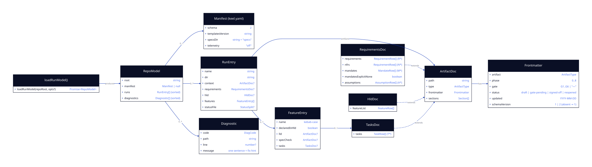

# LLD — run-model

**Status:** LOCKED — G4 re-confirmed by Rohan 2026-07-20 with *Amendment 1* (originally signed 2026-07-19). · **Run:** keel-v2 · **Stack:** see `../../stack.md`

> **Amendment 1 (2026-07-20) — a `Section` must expose more than tables.**
> Building T6 revealed that this LLD specified `tasks.md` as a table, while `templates/tasks.md` — which `requirements.md` locks as the parsing contract ("v1 artifact formats are the parsing contract… as a superset") — uses `## Wave N` headings, `### T<n> — title` headings, and labelled bullets. The LLD contradicted a locked constraint, so **the spec wins and the design changes.**
>
> `Section` gains two fields, both addressing the same root cause — non-table content was invisible to the model:
> - **`bullets`** — top-level list items, which is how tasks are written.
> - **`text`** — the section's paragraph text, without which the Literal Mandates contract ("or the literal text `None` in the section body") cannot be evaluated at all.
>
> The tasks contract is restated below. No Literal Mandate is affected; downstream G5 was re-confirmed as a formality.

> **Amendment 2 (2026-07-20) — `status: set` is a real v1 value.**
> `templates/context.md` ships `status: set`, so the status enum must accept it or every v1 context artifact is reported as broken. Enum becomes `draft | set | gate-pending | signed-off | reopened`.

> **Amendment 3 (2026-07-20) — three artifacts were missing, including two gates'.**
> This LLD recognised six filenames, omitting `stack.md` (**G3**), `review-checklist.md` (**G6**) and `conventions.md`. That is a structural defect, not a gap in coverage: with those files invisible to the model, KC-02 could never evaluate phase order across G3 or G6 — the check engine would silently skip two of the six gates. Found by surveying the frontmatter of every artifact actually present in `templates/`, `examples/` and `specs/`.
>
> `ArtifactType` becomes nine: `context · requirements · hld · stack · conventions · lld · spec-check · tasks · review`. `RunEntry` gains `stack`, `conventions` and `review`. The discovery table below lists all of them.
**Serves requirements:** foundation for R3, R4, R9, R13 · behaviors A6, N1, N6 · feeds KC-01/KC-11 directly

The RunModel is the typed, immutable picture of a repo that every other component consumes — rules, projector, migrator, and the CLI never touch markdown or YAML themselves. The loader's contract in one sentence: **content problems become diagnostics in the model; only environment problems throw.**

---

## Class / Type Design



<details><summary>diagram source (d2, shape: class)</summary>

```d2
direction: right

loader: "loadRunModel()" {
  shape: class
  "+loadRunModel(repoRoot, opts?)": "Promise<RepoModel>"
}

repo: "RepoModel" {
  shape: class
  root: string
  manifest: "Manifest | null"
  runs: "RunEntry[] (sorted)"
  diagnostics: "Diagnostic[] (sorted)"
}

manifest: "Manifest (keel.yaml)" {
  shape: class
  schema: "2"
  templatesVersion: string
  specsDir: "string = \"specs\""
  telemetry: "\"off\""
}

run: "RunEntry" {
  shape: class
  name: string
  dir: string
  context: "ArtifactDoc?"
  requirements: "RequirementsDoc?"
  hld: "HldDoc?"
  features: "FeatureEntry[]"
  statusFile: "StatusSplit?"
}

doc: "ArtifactDoc" {
  shape: class
  path: string
  type: ArtifactType
  frontmatter: Frontmatter
  sections: "Section[]"
}

fm: "Frontmatter" {
  shape: class
  artifact: ArtifactType
  phase: "0..8"
  gate: "G1..G6 | \"—\""
  status: "draft | gate-pending | signed-off | reopened"
  updated: "YYYY-MM-DD"
  schemaVersion: "1 | 2 (absent → 1)"
}

reqdoc: "RequirementsDoc" {
  shape: class
  requirements: "RequirementRow[] (R*)"
  nfrs: "RequirementRow[] (N*)"
  mandates: "MandateRow[] (M*)"
  mandatesExplicitNone: boolean
  assumptions: "AssumptionRow[] (A*)"
}

hlddoc: "HldDoc" {
  shape: class
  featureList: "FeatureRow[]"
}

feat: "FeatureEntry" {
  shape: class
  name: kebab-case
  declaredInHld: boolean
  lld: "ArtifactDoc?"
  specCheck: "ArtifactDoc?"
  tasks: "TasksDoc?"
}

tasksdoc: "TasksDoc" {
  shape: class
  tasks: "TaskRow[] (T*)"
}

diag: "Diagnostic" {
  shape: class
  code: DiagCode
  path: string
  line: "number?"
  message: "one sentence + fix hint"
}

loader -> repo: produces
repo -> manifest: "0..1"
repo -> run: "0..*"
repo -> diag: "0..*"
run -> doc: "artifacts"
run -> feat: "0..*"
doc -> fm: has
reqdoc -> doc: extends { style.stroke-dash: 3 }
hlddoc -> doc: extends { style.stroke-dash: 3 }
tasksdoc -> doc: extends { style.stroke-dash: 3 }
feat -> tasksdoc: "0..1"
```

</details>

| Type | Responsibility | Serves |
|------|----------------|--------|
| `loadRunModel` | Single entry point; discovery + parse + assemble; never mutates anything | R3, R4, R9, R13 |
| `RepoModel` | Immutable root: manifest, runs, diagnostics. `manifest: null` ⇔ no `keel.yaml` (the A6 case) | A6 |
| `Manifest` | Parsed `keel.yaml` (zod-validated) | R1, R13 |
| `RunEntry` | One `specs/<name>/` directory with its typed artifacts and features | R3, R9 |
| `ArtifactDoc` + `Frontmatter` | One markdown artifact: validated frontmatter + sectioned body (mdast) | KC-01, KC-02 |
| `RequirementsDoc` / `HldDoc` / `TasksDoc` | `ArtifactDoc` specializations carrying their extracted tables | KC-03…08, KC-11 |
| `FeatureEntry` | Union of HLD-declared features and `features/*` dirs; `declaredInHld` powers KC-06 | KC-06, KC-07 |
| `Diagnostic` | A content problem as a value (code, path, line, message with fix hint) | N6, KC-01/KC-11 |

## Interfaces / Contracts

The exact public surface of `@keel-dev/core/model` (everything else in this doc serves this block):

```ts
export async function loadRunModel(repoRoot: string, opts?: LoadOptions): Promise<RepoModel>;

export interface LoadOptions {
  runFilter?: string;      // load only specs/<runFilter> (still discovers all run names)
}

export interface RepoModel {
  readonly root: string;                  // absolute path
  readonly manifest: Manifest | null;     // null ⇔ keel.yaml absent (A6); see error model for malformed
  readonly runs: readonly RunEntry[];     // sorted by name (codepoint order)
  readonly diagnostics: readonly Diagnostic[];  // sorted by (path, line ?? 0, code)
}

export interface Manifest {
  schema: 2;
  templatesVersion: string;               // semver of installed templates
  specsDir: string;                       // default "specs"
  telemetry: "off";                       // only legal value in v2.0 (D5)
}

export interface RunEntry {
  name: string;                           // directory name, must match /^[a-z0-9]+(-[a-z0-9]+)*$/
  dir: string;                            // `${specsDir}/${name}`, repo-relative POSIX path
  context?: ArtifactDoc;
  requirements?: RequirementsDoc;
  hld?: HldDoc;
  features: FeatureEntry[];               // sorted by name
  statusFile?: StatusSplit;
}

export type ArtifactType =                              // amendment 3 — nine, not six
  | "context" | "requirements" | "hld" | "stack" | "conventions"
  | "lld" | "spec-check" | "tasks" | "review";
export type Gate = "G1" | "G2" | "G3" | "G4" | "G5" | "G6";
export type ArtifactStatus =                            // amendment 2 — "set" is a v1 value
  "draft" | "set" | "gate-pending" | "signed-off" | "reopened";

export interface ArtifactDoc {
  path: string;                           // repo-relative POSIX path
  type: ArtifactType;
  frontmatter: Frontmatter;
  sections: Section[];                    // H2/H3 headings with their mdast content
}

export interface Frontmatter {
  artifact: ArtifactType;
  phase: number;                          // integer 0–8
  gate: Gate | "—";
  status: ArtifactStatus;
  updated: string;                        // "YYYY-MM-DD" (string-validated, not Date)
  schemaVersion: 1 | 2;                   // key `schema_version`; absent in file → 1
}

export interface Section {
  heading: string;
  depth: 2 | 3;
  line: number;
  tables: MdTable[];
  bullets: BulletItem[];              // amendment 1 — heading-structured artifacts (tasks)
  text: string;                       // amendment 1 — paragraph text (Literal Mandates "None")
}
export interface BulletItem { text: string; line: number }   // top-level list item, flattened
export interface MdTable { headerCells: string[]; rows: { cells: string[]; line: number }[]; line: number }

export interface RequirementsDoc extends ArtifactDoc {
  requirements: RequirementRow[];         // R* — document order
  nfrs: RequirementRow[];                 // N*
  mandates: MandateRow[];                 // M*
  mandatesExplicitNone: boolean;          // true ⇔ section contains literal "None" and zero M rows
  assumptions: AssumptionRow[];           // A* (id optional — v1 files have no A ids)
}
export interface RequirementRow { id: string; text: string; acceptance: string; line: number }
export interface MandateRow    { id: string; text: string; source: string; line: number }
export interface AssumptionRow { id?: string; text: string; status: "proposed" | "confirmed"; line: number }

export interface HldDoc extends ArtifactDoc {
  featureList: FeatureRow[];
}
export interface FeatureRow { name: string; delivers: string[]; lldPath: string; line: number }

export interface FeatureEntry {
  name: string;
  declaredInHld: boolean;
  lld?: ArtifactDoc;
  specCheck?: ArtifactDoc;
  tasks?: TasksDoc;
}

export interface TasksDoc extends ArtifactDoc {
  tasks: TaskRow[];
}
export interface TaskRow {
  id: string;                             // T\d+
  title: string;
  requirements: string[];                 // R/N ids it advances
  dependsOn: string[];                    // T ids
  wave: number;                           // integer ≥ 1
  files: string[];                        // declared touch-set (KC-08 collision check)
  done: boolean;
  dod: string;
  line: number;
}

export interface StatusSplit { nowRaw: string; sessionLogRaw: string }  // split at "## Session log"

export interface Diagnostic {
  code: DiagCode;
  path: string;
  line?: number;
  message: string;                        // one sentence naming the problem + one fix hint (N6)
}
export type DiagCode =
  | "manifest-invalid"                    // keel.yaml present but fails schema
  | "frontmatter-missing" | "frontmatter-invalid"
  | "artifact-type-mismatch"              // frontmatter.artifact ≠ filename-implied type
  | "section-missing" | "table-missing" | "column-missing"
  | "row-malformed" | "id-malformed" | "id-duplicate"
  | "run-name-invalid" | "status-split-missing";
```

**ID grammar** (module-level constants, exported for KC-11): `R\d+` · `N\d+` · `M\d+` · `A\d+` · `T\d+` · feature/run names `^[a-z0-9]+(-[a-z0-9]+)*$`. ID lists in cells are comma- or `·`-separated; whitespace-trimmed.

## Concrete Data Model

No database — the "schema" is three file contracts. (The conceptual ERD lives in `../../hld.md`; the class diagram above is this feature's schema diagram.)

### `keel.yaml` (repo root)
| Field | Type | Constraint |
|-------|------|------------|
| `schema` | int literal | must be `2` |
| `templates_version` | string | semver; NOT NULL |
| `specs_dir` | string | optional; default `"specs"` |
| `telemetry` | string | optional; only legal value `"off"` (D5) |

Unknown keys → `manifest-invalid` diagnostic (forward-compat is `upgrade`'s job, not silent tolerance). Parsed with `yaml`; validated with zod.

### Artifact frontmatter (YAML block delimited by `---` at byte 0)
| Field | Type | Constraint |
|-------|------|------------|
| `artifact` | enum | one of the six `ArtifactType`s; must match the filename rule below |
| `phase` | int | 0–8 |
| `gate` | enum | `G1`–`G6` or `"—"` |
| `status` | enum | `draft` · `gate-pending` · `signed-off` · `reopened` |
| `updated` | string | `^\d{4}-\d{2}-\d{2}$` |
| `schema_version` | int | optional; `1` or `2`; **absent → 1** (v1 file, pre-`upgrade`) |

Extra keys are ignored (v1 templates carry comments/varia). Parsed with gray-matter; validated with zod; zod issues map to one `frontmatter-invalid` diagnostic each, `line` = the frontmatter block's first line.

### Discovery & filename rules (how files become the model)
| On disk | Becomes | Rule |
|---------|---------|------|
| `keel.yaml` | `manifest` | absent → `manifest: null`, **zero diagnostics** (A6) |
| `<specsDir>/<name>/` | `RunEntry` | only if the dir contains ≥ 1 recognized artifact file; `<name>` must match the kebab grammar else `run-name-invalid` |
| `context.md` · `requirements.md` · `hld.md` · `stack.md` · `conventions.md` · `review-checklist.md` | typed docs (amendment 3 — `stack.md` carries **G3**, `review-checklist.md` carries **G6**) | filename ⇒ expected `artifact` value (`review-checklist.md` ⇒ `review`); mismatch → `artifact-type-mismatch` |
| `STATUS.md` | `statusFile` | split on the literal heading `## Session log`; missing → `status-split-missing` |
| `features/<f>/lld.md` · `spec-check.md` · `tasks.md` | `FeatureEntry` fields | `FeatureEntry` set = HLD feature list ∪ `features/*` dirs; `declaredInHld` marks the first source |
| anything else | ignored | diagrams, decisions, README — never parsed, never diagnosed |

### Table-extraction contracts (heading → columns)
Tables are found inside the section whose H2 heading **starts with** the anchor text (case-insensitive) — prose around them is free-form and never parsed:

| Anchor heading | Doc | Required columns (header-prefix match, extras ignored) |
|----------------|-----|--------------------------------------------------------|
| `Functional Requirements` | requirements | `ID`, `Requirement`, `Acceptance` |
| `Non-Functional Requirements` | requirements | `ID`, `Concern` or `Requirement` (text = concatenated), any |
| `Literal Mandates` | requirements | `ID`, `Mandate`, `Source` — or the literal text `None` in the section body (`mandatesExplicitNone`) |
| `Assumptions` | requirements | `Assumption` (or `ID`+`Assumption`), `Status` — status cell starting `confirmed` ⇒ `confirmed`, else `proposed` |
| `Feature List` | hld | `Feature` (name = first backtick-token or leading text), `Delivers`, `LLD` |

**Tasks are not tabular** (amendment 1). `tasks.md` is heading-structured, and the extractor reads it as:

| Element | Pattern | Yields |
|---------|---------|--------|
| Wave heading | H2 matching `/^Wave\s+(\d+)/i` | the wave number for every task beneath it |
| Task heading | H3 matching `/^(T\d+)\s*[—–-]\s*(.+)$/` | `TaskRow.id`, `.title`, `.line` |
| Labelled bullet | `- **Label:** value`, several per bullet separated by `·` | `Goal` → (context only) · `Done when` → `dod` · `Files` → comma-separated paths · `Depends on` → task IDs · `Satisfies` → requirement IDs |
| Status bullet | a bullet containing `[x]`, `[✓]` or `[ ]` | `done` |

`—` in any list-valued label means "none". A task heading appearing before any wave heading gets `wave: 0` and a `row-malformed` diagnostic — the waves are what make parallel execution safe, so an unplaced task is a defect, not a default.

Missing section → `section-missing`; section without its table → `table-missing`; header lacking a required column → `column-missing` (one diagnostic, table skipped); a bad row → `row-malformed` (row skipped, rest kept). Skips are always visible as diagnostics — the loader never silently drops content.

## Error Model

| Failure | Trigger | Result | Behavior after |
|---------|---------|--------|----------------|
| Not a directory / unreadable root | bad `repoRoot` | **throws** `KeelError{code:"ENV_BAD_ROOT"}` → CLI exit 2 | nothing loaded |
| File unreadable (permissions, I/O) | any artifact read fails | **throws** `KeelError{code:"ENV_UNREADABLE", path}` → exit 2 | fail fast — a partial model is worse than none |
| `keel.yaml` absent | file not found | `manifest: null`, zero diagnostics | commands apply A6 (`check` → exit 0 + notice; `--strict` → exit 2) |
| `keel.yaml` malformed | YAML error or zod failure | `manifest: null` **+ `manifest-invalid` diagnostic** | distinguishes "not a keel repo" from "broken keel repo" — KC-01 blocks on it |
| Frontmatter missing / invalid | no `---` block · zod failure | diagnostic per issue | doc still enters the model with best-effort fields; KC-01 turns diagnostics into block findings |
| Table/section/column missing, row or ID malformed, duplicate ID | extraction contracts above | one diagnostic each, precise `line` | extraction continues; nothing silently dropped |
| Duplicate run dir resolving to same name | filesystem case oddities | `id-duplicate` diagnostic on the second | first wins deterministically (sort order) |

The split is the codebook's two-channel rule verbatim: **environment throws (exit 2), content diagnoses (feeds exit 1 via rules)** — a hook can always tell "Keel is broken" from "Keel said no."

## Concurrency / Consistency Notes

- **Single-process, read-only, no locks.** The loader takes no writes and holds no state between calls; concurrent `keel` invocations are safe by construction.
- **Determinism (N1):** output is a pure function of file bytes. No clock, no network, no env vars, no git. All collections explicitly sorted (runs/features by name, diagnostics by path→line→code, rows in document order). Two runs on the same tree are byte-identical.
- **Latency budget (N3):** one `readdir` sweep + one read per artifact; remark parses only the six recognized filenames (diagrams/decisions never parsed). Loader's share of the < 2 s full-check budget on a ≤ 20-run repo: **< 300 ms**, verified by a fixture benchmark in Phase 7 — a budget, not a claimed benchmark.
- **Immutability:** the returned model is deep-frozen in dev/test builds (cheap tripwire for rule purity); production builds rely on `readonly` types.

---

## G4 — LLD Sign-off

- [x] One-Line Test passes: a builder could implement this from this doc alone
- [x] Every type/contract traces to a requirement
- [x] Error model covers every failure mode
- [x] Concurrency/consistency requirements are explicitly satisfied
- [x] **Human has confirmed the design before build** — Rohan, 2026-07-19
