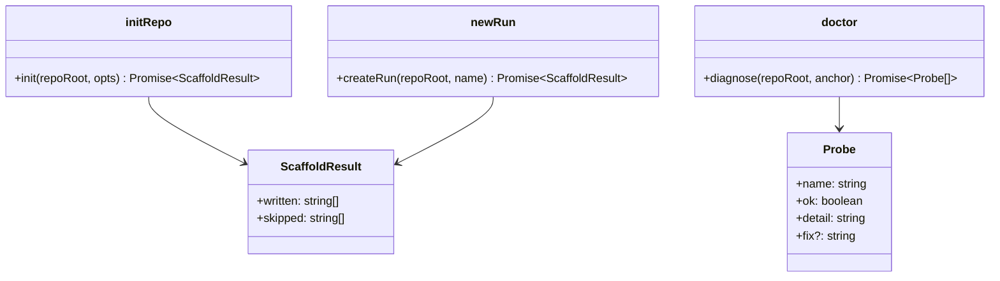

# LLD — scaffold

**Status:** DRAFT → (signed off after G4) · **Run:** keel-v2 · **Stack:** see `../../stack.md`
**Serves requirements:** R1 (init), R2 (run new), R14 (doctor) + the command surface for R3–R9 · **Mandates:** M3 (exit contract), M6 · **NFRs:** N4, N6

This feature makes Keel usable: the scaffolding commands, and the `@keel-dev/cli` package that
finally puts a `keel` binary in someone's hands. It is where `prepareSeal → print → confirm →
commitSeal` is wired, which is the entire reason those were two functions.

---

## Class / Type Design



| Type | Responsibility | Serves |
|------|----------------|--------|
| `init` | Write `keel.yaml`, install templates + `templates/VERSION`, wire hooks. Idempotent; **never overwrites**. | R1 |
| `createRun` | Create `specs/<name>/` with `context.md` and `STATUS.md` from the installed templates. | R2 |
| `diagnose` | Read-only environment probes: git, tree state, ledger health, hook wiring, manifest. | R14 |
| `ScaffoldResult` | What was written and what was left alone — so the CLI can say so honestly. | R1, R2 |
| `Probe` | One check with its verdict and, when it fails, the fix. | R14, N6 |

## Interfaces / Contracts

```ts
export interface ScaffoldResult {
  written: string[];      // repo-relative paths created
  skipped: string[];      // paths that already existed and were left untouched
}

export function init(args: {
  repoRoot: string;
  /** Where the shipped templates live; defaults to the package's own assets. */
  assetsDir?: string;
}): Promise<ScaffoldResult>;

export function createRun(args: { repoRoot: string; name: string }): Promise<ScaffoldResult>;

export interface Probe {
  name: string;
  ok: boolean;
  detail: string;
  /** The single next action, present only when ok is false. */
  fix?: string;
}

export function diagnose(args: { repoRoot: string; anchor: GitAnchor }): Promise<Probe[]>;
```

### The CLI (`@keel-dev/cli`, bin `keel`)

| Command | Behaviour |
|---------|-----------|
| `keel init` | `init()`, then prints what was written and what was skipped |
| `keel run new <name>` | `createRun()`; rejects a name that is not kebab-case |
| `keel check [--run r] [--strict] [--format agent\|ci]` | `buildContext` + `runChecks` |
| `keel check --require G<n> --run r [--feature f]` | **`requireGateFast`** — the hook path, no markdown parsed |
| `keel gate pass G<n> --run r --artifact p [--allow-dirty] [--yes]` | `prepareSeal` → **print the seal** → confirm → `commitSeal` → `setArtifactState` → `writeStatus` |
| `keel gate reopen G<n> --run r --artifact p` | `reopenGate` → `setArtifactState(reopened)` → `writeStatus` |
| `keel status [--run r]` | `deriveRunState` → `writeStatus`, reporting whether anything changed |
| `keel doctor` | `diagnose()` |

**Exit codes (M3), assigned in exactly one place — the CLI's top-level handler:**
`0` clean or warn-only · `1` at least one block finding, or a gate assertion that failed ·
`2` `KeelError` or `GateRefusal` — the environment, not the verdict.

**Output formats.** `human` (default, aligned and coloured only when TTY) · `--format agent` (one
line per finding, then the single next action — written to be read by a model) · `--ci` (GitHub
`::error file=…,line=…::` annotations plus a summary).

**Confirmation.** `gate pass` prints the prepared seal and asks before writing. `--yes` skips the
prompt for non-interactive use; when stdin is not a TTY and `--yes` was not given, it **refuses**
rather than assuming consent.

## Concrete Data Model

`init` writes, and skips anything already present:

| Path | Contents |
|------|----------|
| `keel.yaml` | `schema: 2`, `templates_version` from the shipped assets, `specs_dir: specs`, `telemetry: off` |
| `templates/*.md` | the shipped artifact templates |
| `templates/VERSION` | the version marker KC-12 compares against |
| `.claude/settings.json` | `PreToolUse` matchers → `keel check --require` (merged, never clobbered) |
| `.git/hooks/prepare-commit-msg` | the attribution trailer hook (only if absent) |
| `.keel/` | created lazily by the ledger, not here |

## Error Model

| Failure | Trigger | Result |
|---------|---------|--------|
| Not a git repository | `init` outside git | `KeelError{ENV_BAD_ROOT}` → exit 2 |
| File already exists | re-running `init` | listed in `skipped`; **never overwritten** — exit 0 |
| `.claude/settings.json` exists with other content | user has settings | merge the matchers; on unparseable JSON, skip and report |
| Run name not kebab-case | `run new My_Run` | `KeelError` → exit 2, naming the rule |
| Run already exists | `run new` twice | `KeelError` → exit 2; nothing written |
| Templates missing from the package | broken install | `KeelError{ENV_UNREADABLE}` → exit 2 |
| Not a TTY and no `--yes` on `gate pass` | piped invocation | `GateRefusal` → exit 2 — consent is never assumed |

## Concurrency / Consistency Notes

- **Idempotence is the contract** for `init` and `run new`: re-running writes nothing new and reports
  what it skipped. This is what makes `keel init` safe to run on an existing repo (R1).
- **Ordering after a gate event** is fixed: ledger append (the commit point) → frontmatter → STATUS.
  A failure after the append leaves the gate sealed and the projection stale, which KC-10 reports and
  `keel status` repairs (ADR 0002).
- **The exit code is computed once**, in the CLI's top-level handler, from the report and the error
  type — no command sets it directly (M3).
- **`--require` never builds a full context** (N3): it calls `requireGateFast`.

---

## G4 — LLD Sign-off

- [x] One-Line Test passes: a builder could implement this from this doc alone
- [x] Every type/contract traces to a requirement
- [x] Error model covers every failure mode
- [x] Concurrency/consistency requirements are explicitly satisfied
- [x] **Human has confirmed the design before build**
