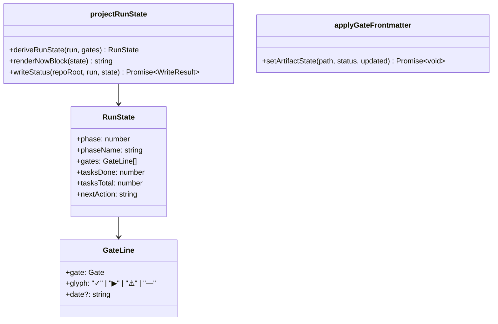

# LLD — state-projection

**Status:** DRAFT → (signed off after G4) · **Run:** keel-v2 · **Stack:** see `../../stack.md`
**Serves requirements:** R9 (derive status) + the projection halves of R5 and R8 · **Mandates:** M6 (the A5 exception lives here) · **NFRs:** N1, N2

The ledger is the truth; this feature is how humans read it. It renders derived state into
`STATUS.md`'s `Now` block and keeps artifact frontmatter in step after a gate event — the **only two
places in the entire system where Keel writes into a file a human authored**, and both write state,
never content.

---

## Class / Type Design



| Type | Responsibility | Serves |
|------|----------------|--------|
| `RunState` | The derived snapshot: phase, one line per gate, task rollup, next action. Pure data. | R9 |
| `deriveRunState` | `(RunEntry, GateStatus[]) → RunState`. No I/O, no clock. | R9, N1 |
| `renderNowBlock` | `RunState → string`. Deterministic markdown, matching `templates/status.md`. | R9 |
| `writeStatus` | Replaces **only** the region above `## Session log`; the log is passed through byte-for-byte. | R9, N2 |
| `setArtifactState` | Rewrites `status:` and `updated:` in an artifact's frontmatter, leaving every other byte alone. | R5, R8, A5/M6 |

## Interfaces / Contracts

```ts
export interface GateLine {
  gate: Gate;
  /** ✓ sealed · ▶ in progress (reopened) · ⚠ broken or blocked · — no record */
  glyph: "✓" | "▶" | "⚠" | "—";
  /** Date of the sealing event, YYYY-MM-DD, when there is one. */
  date?: string;
}

export interface RunState {
  run: string;
  phase: number;               // 0–8, derived from the furthest sealed gate
  phaseName: string;
  gates: GateLine[];           // always six, in order
  tasksDone: number;
  tasksTotal: number;
  nextAction: string;
}

export function deriveRunState(args: { run: RunEntry; gates: GateStatus[] }): RunState;

export function renderNowBlock(state: RunState): string;

export interface WriteResult {
  path: string;
  changed: boolean;            // false when the projection already matched
}

/** Rewrites only the Now zone. Refuses if there is no `## Session log` heading to split on. */
export function writeStatus(args: {
  repoRoot: string;
  run: RunEntry;
  state: RunState;
}): Promise<WriteResult>;

/**
 * The A5 exception, and the only artifact write in the system besides STATUS.
 * Touches `status` and `updated` and nothing else — the body is never re-serialised.
 */
export function setArtifactState(args: {
  repoRoot: string;
  path: string;
  status: ArtifactStatus;
  updated: string;             // YYYY-MM-DD, supplied by the caller (no clock in here)
}): Promise<WriteResult>;
```

**Phase derivation.** Phase = the index of the furthest *sealed* gate, mapped
`G1→1, G2→2, G3→3, G4→4, G5→5, G6→8`, with `0` when nothing is sealed; a run whose furthest gate is
sealed but which has tasks in progress reads as phase 7 (Build & Test). Deliberately coarse: it is a
signpost for a human, not a state machine anyone branches on.

**Next action** is the single imperative the reader should perform, chosen in this order: a broken
seal → "re-confirm and re-seal"; an unsealed next gate → "confirm and seal it"; unfinished tasks →
"continue building"; everything sealed → "run the review".

## Concrete Data Model

No store. Two file-editing contracts:

### `STATUS.md`
Split on the first `## Session log` heading. Everything above is replaced with the rendered `Now`
block; everything from the heading onward is copied through **unchanged**. If the heading is absent,
`writeStatus` refuses rather than guessing where the log starts — an append-only log is not
something to risk truncating.

### Artifact frontmatter
Line-oriented rewrite: find `^status:` and `^updated:` inside the leading `---` block and replace
those lines' values. The YAML is **not** parsed and re-emitted — that would reformat comments and
key order, and this feature is not licensed to touch anything but two values.

## Error Model

| Failure | Trigger | Result | Behaviour |
|---------|---------|--------|-----------|
| No `## Session log` in STATUS | malformed status file | `KeelError{ENV_UNREADABLE}` → exit 2 | nothing written; the log is never at risk |
| Projection already matches | idempotent re-run | `WriteResult{changed:false}` | no write at all, so no spurious git churn |
| Artifact has no frontmatter block | file not an artifact | `KeelError{ENV_UNREADABLE}` → exit 2 | nothing written |
| `status:`/`updated:` keys absent | hand-mangled frontmatter | `KeelError{ENV_UNREADABLE}` naming the file | nothing written — inserting keys is authoring, which M6 forbids |
| STATUS unwritable | permissions | `KeelError{ENV_UNREADABLE}` → exit 2 | the gate itself remains sealed; the ledger already committed (ADR 0002) |

## Concurrency / Consistency Notes

- **The ledger commits first, the projection follows.** A failure here leaves the gate sealed and the
  frontmatter stale, which is exactly the drift KC-10 reports and `keel status` repairs. No rollback,
  no compensating write.
- **Determinism (N1):** `deriveRunState` and `renderNowBlock` are pure; the date written into
  frontmatter is supplied by the caller, so nothing in this feature reads a clock.
- **Idempotent:** re-running produces byte-identical output and skips the write entirely when nothing
  changed.
- **The session log is sacred** (N2): it is copied through, never re-rendered, and a missing heading
  aborts rather than risking it.

---

## G4 — LLD Sign-off

- [x] One-Line Test passes: a builder could implement this from this doc alone
- [x] Every type/contract traces to a requirement
- [x] Error model covers every failure mode
- [x] Concurrency/consistency requirements are explicitly satisfied
- [x] **Human has confirmed the design before build**
