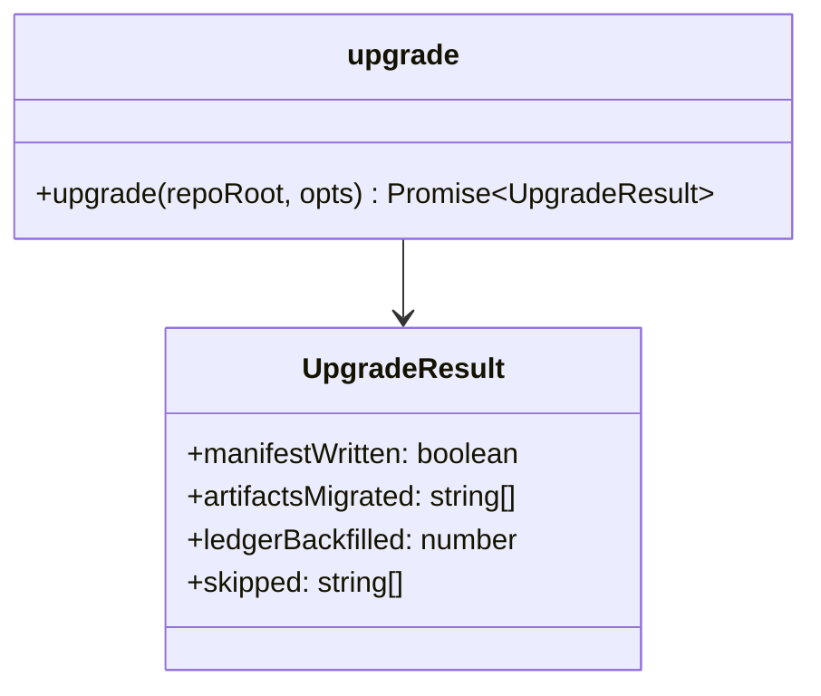

# LLD — upgrade

**Status:** LOCKED (G4, 2026-07-21) · **Run:** keel-v2 · **Stack:** see `../../stack.md`
**Serves requirements:** R13 (migrate v1 runs) · **Mandates:** M8 · **NFRs:** N2

The migrator brings a v1 repository — markdown artifacts, `status: signed-off` in frontmatter, no
ledger — up to schema v2 without touching a word of the prose. Its acceptance test is concrete:
`examples/ticket-booking` migrates with zero manual edits.

---

## Class / Type Design



| Type | Responsibility | Serves |
|------|----------------|--------|
| `upgrade` | Clean-tree guard, then: write `keel.yaml`, bump each artifact's frontmatter to `schema_version: 2`, backfill the ledger from `signed-off` frontmatter. Idempotent. | R13, M8 |
| `UpgradeResult` | What changed, so the CLI reports it honestly. | R13 |

## Interfaces / Contracts

```ts
export interface UpgradeResult {
  manifestWritten: boolean;
  artifactsMigrated: string[];   // paths whose schema_version was set to 2
  ledgerBackfilled: number;      // legacy entries added
  skipped: string[];
}

export function upgrade(args: {
  repoRoot: string;
  anchor: GitAnchor;
  now?: () => Date;
}): Promise<UpgradeResult>;
```

**Migration steps, in order:**
1. **Refuse on a dirty tree** (M8) — a migration touches many files; it must be reviewable as one
   clean diff. `GateRefusal{dirty-tree}` → exit 2.
2. **Write `keel.yaml`** if absent (schema 2, `templates_version` from the shipped assets).
3. **Bump frontmatter:** for every artifact whose `schema_version` is absent or 1, set it to 2 via
   `setArtifactState`-style line editing — **only** the `schema_version` line, nothing else. An
   artifact with no frontmatter is skipped and reported.
4. **Backfill the ledger:** for every artifact whose frontmatter `status` is `signed-off` and which
   has no ledger entry yet, append a `GateEvent` with `legacy: true` (M8), the artifact's current
   `git hash-object`, the current HEAD commit, and the git identity. The `gate` is read from the
   artifact's frontmatter.

**Honesty of a legacy entry (M8, N5):** it is marked `legacy: true` because its sign-off happened in
v1, before the ledger existed — Keel records that it *claims* to have been signed, not that it
witnessed the signing. The hash and commit are real (computed now); only the sign-off event is
historical.

## Concrete Data Model

Backfilled entry:

```jsonl
{"run":"…","gate":"G1","event":"pass","artifact":"…","artifact_hash":"…","actor":"…","commit":"…","ts":"…","legacy":true}
```

Identical to a normal entry (M1 field set) plus `legacy: true`. Because the backfill hashes the
current file (already at v2 frontmatter after step 3), the seal it creates holds immediately.

## Error Model

| Failure | Trigger | Result |
|---------|---------|--------|
| Dirty tree | uncommitted changes | `GateRefusal{dirty-tree}` → exit 2, nothing written (M8) |
| Not a git repo | no `.git` | `GateRefusal{not-a-repository}` → exit 2 |
| No commits | empty repo | `GateRefusal{no-commit}` → exit 2 |
| Already v2 | re-running | idempotent: manifest skipped, no frontmatter bumped, no duplicate ledger entries |
| Artifact without frontmatter | stray markdown | skipped and reported, not an error |

## Concurrency / Consistency Notes

- **Clean tree in, one clean diff out** (M8): the migration is reviewable as a single commit, which
  is the whole point of refusing on a dirty tree.
- **Idempotent** (R13): a second run writes nothing — `schema_version` is already 2, entries already
  exist. Re-running is a no-op.
- **Append-only** (N2): backfill only *adds* legacy entries; it never edits an existing one.
- **Order matters:** frontmatter is bumped (step 3) before the ledger is backfilled (step 4), so the
  hash a legacy entry seals is the v2 content that will sit on disk — the seal holds without a
  follow-up projection.

---

## G4 — LLD Sign-off

- [x] One-Line Test passes: a builder could implement this from this doc alone
- [x] Every type/contract traces to a requirement
- [x] Error model covers every failure mode
- [x] Concurrency/consistency requirements are explicitly satisfied
- [x] **Human has confirmed the design before build**
