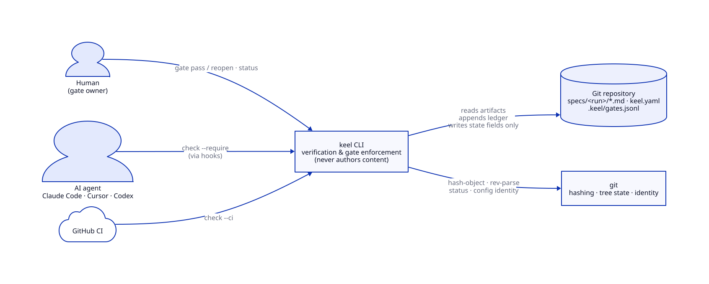
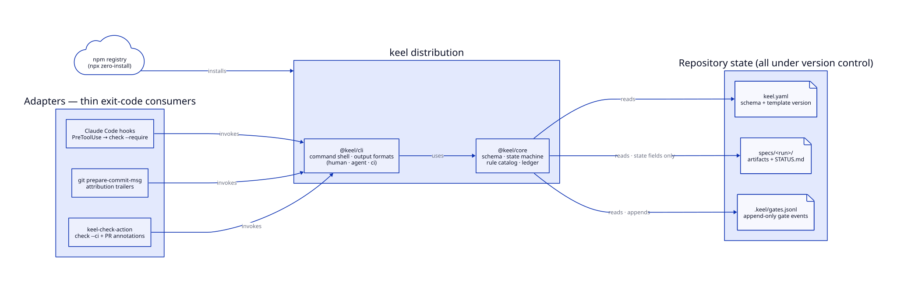
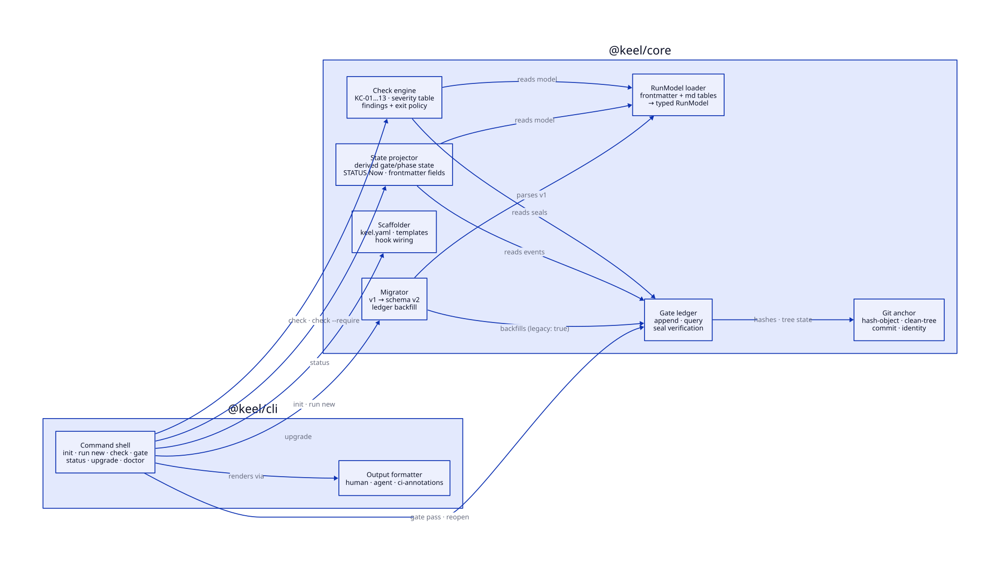
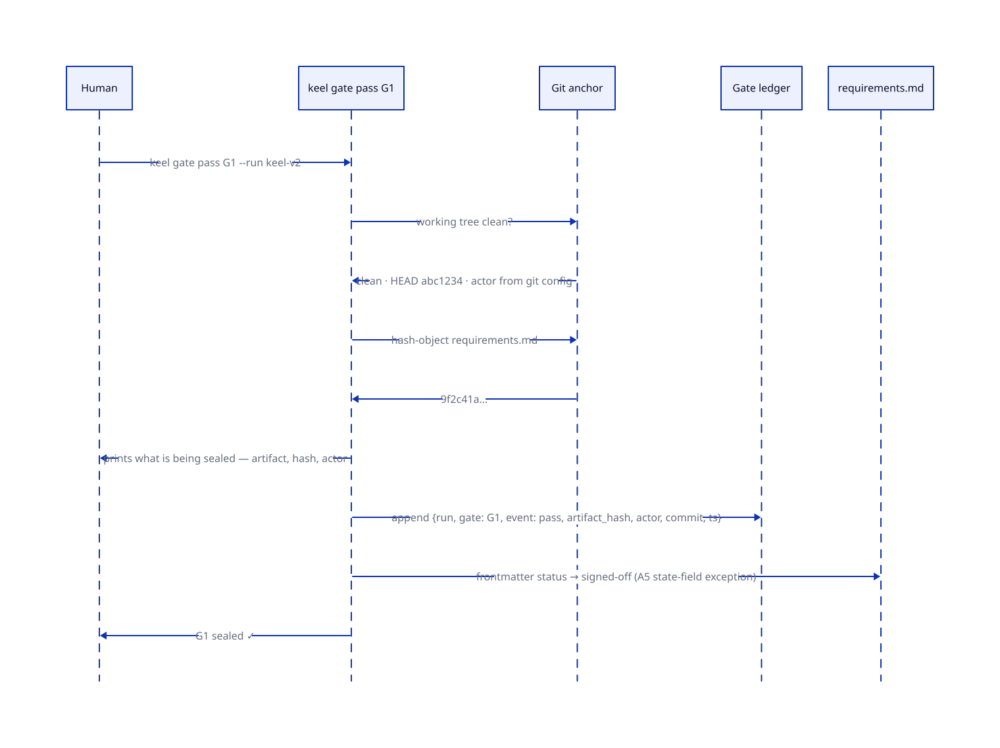
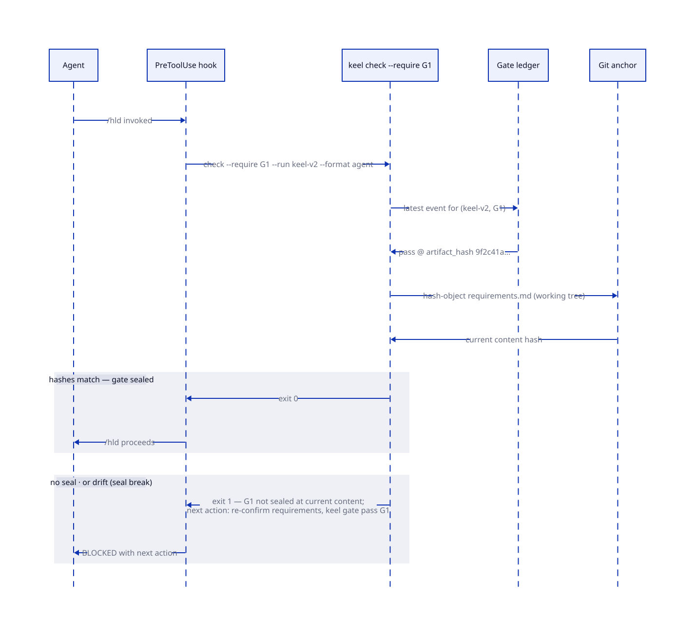
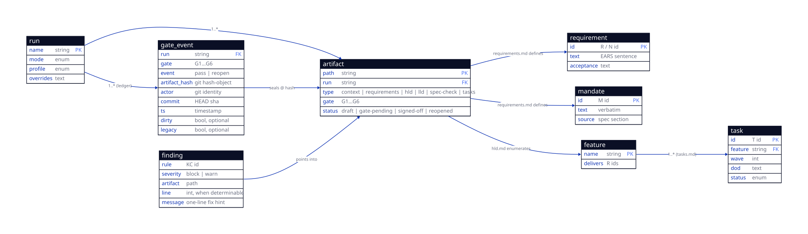

# High-Level Design — keel-v2

**Status:** LOCKED (G2 signed by Rohan, 2026-07-13) · **Requirements:** see `requirements.md` (LOCKED, G1 2026-07-13)

---

## Critical Design Questions

### Q1 — Where does gate truth live: ledger, frontmatter, or both?
- **Options:** (a) ledger authoritative, frontmatter a derived projection · (b) frontmatter authoritative, ledger an audit log · (c) both authoritative, must agree.
- **Decision:** **(a) The ledger is the single source of gate truth.** Frontmatter `status` is a human-readable projection the CLI keeps in sync (the A5 state-field exception exists precisely for this). KC-10 checks the projection, never arbitrates it.
- **Why:** Only the ledger is hash-anchored, append-only, and tamper-evident (N2, M1). Two authoritative sources is the classic drift bug this tool exists to kill; frontmatter-as-truth would make a hand-edit indistinguishable from a sign-off. v1 compatibility survives because the projection keeps frontmatter looking exactly as v1 expects. (→ ADR at Phase 3.)

### Q2 — How is seal integrity verified, and how does invalidation propagate?
- **Options:** compare sealed hash against HEAD content vs. against the **working tree** · store invalidation records when a seal breaks vs. **derive** invalidation at check time.
- **Decision:** `check` hashes the **working-tree** artifact (`git hash-object`) and compares it to the latest `pass` event's `artifact_hash`. Downstream invalidation ("G1 broke, so G2–G6 are invalid") is **derived at read time** from the gate dependency order — never written anywhere.
- **Why:** The working tree is what the agent is about to build on — an uncommitted edit to sealed requirements must block immediately (R7, N3's hook path), not after a commit. Deriving invalidation keeps the ledger append-only (M1, N2) and stateless-correct: fixing the artifact back to its sealed content heals everything with zero cleanup. In CI the checked-out tree *is* the working tree, so one code path serves both (R12).

### Q3 — What shape is the rule catalog so severities stay data and rules stay honest?
- **Options:** fully declarative rule DSL (YAML) · **code-with-metadata** (typed predicate + declarative metadata, one severity table) · severities hardcoded per rule site.
- **Decision:** **Code-with-metadata.** Each rule is a pure function over the loaded `RunModel` + ledger, exported with static metadata (`id`, `severity`, `description`, fix-hint template). Severities live in exactly one table mirroring M4. Rules never read files or git directly — the loader and anchor feed them.
- **Why:** A YAML DSL for 13 rules is speculative abstraction (P4); scattered severity constants would make M4 unverifiable. Pure rules over one loaded model gives N1's determinism for free and makes golden-fixture testing (the profile's testing→production override) trivial: fixture repo in, findings out.

---

## C4 Level 1 — System Context

Two kinds of caller, one system, and everything stateful lives in the git repository — the CLI has no store of its own.



<details><summary>diagram source (d2)</summary>

```d2
direction: right

human: "Human\n(gate owner)" { shape: person }
agent: "AI agent\nClaude Code · Cursor · Codex" { shape: person }
ci: "GitHub CI" { shape: cloud }

keel: "keel CLI\nverification & gate enforcement\n(never authors content)"

repo: "Git repository\nspecs/<run>/*.md · keel.yaml\n.keel/gates.jsonl" { shape: cylinder }
git: "git\nhashing · tree state · identity"

human -> keel: "gate pass / reopen · status"
agent -> keel: "check --require\n(via hooks)"
ci -> keel: "check --ci"
keel -> repo: "reads artifacts\nappends ledger\nwrites state fields only"
keel -> git: "hash-object · rev-parse\nstatus · config identity"
```

</details>

## C4 Level 2 — Containers

Two npm packages plus three thin adapters. Adapters carry no logic — they invoke the CLI and consume exit codes, which is what keeps Keel agent-agnostic (an adapter for a new agent is configuration, not code).



<details><summary>diagram source (d2)</summary>

```d2
direction: right

npm: "npm registry\n(npx zero-install)" { shape: cloud }

pkg: "keel distribution" {
  cli: "@keel/cli\ncommand shell · output formats\n(human · agent · ci)"
  core: "@keel/core\nschema · state machine\nrule catalog · ledger"
  cli -> core: uses
}

adapters: "Adapters — thin exit-code consumers" {
  cchook: "Claude Code hooks\nPreToolUse → check --require"
  ghook: "git prepare-commit-msg\nattribution trailers"
  action: "keel-check-action\ncheck --ci + PR annotations"
}

state: "Repository state (all under version control)" {
  manifest: "keel.yaml\nschema + template version" { shape: page }
  specs: "specs/<run>/\nartifacts + STATUS.md" { shape: page }
  ledger: ".keel/gates.jsonl\nappend-only gate events" { shape: page }
}

npm -> pkg: installs
adapters.cchook -> pkg.cli: invokes
adapters.ghook -> pkg.cli: invokes
adapters.action -> pkg.cli: invokes
pkg.core -> state.manifest: reads
pkg.core -> state.specs: "reads · state fields only"
pkg.core -> state.ledger: "reads · appends"
```

</details>

## C4 Level 3 — Components

Inside the two packages. The dependency direction is strict: the check engine and projector read through the loader and ledger; only the ledger touches the git anchor for writes-adjacent state; nothing in `core` formats output.



<details><summary>diagram source (d2)</summary>

```d2
direction: right

cli: "@keel/cli" {
  cmd: "Command shell\ninit · run new · check · gate\nstatus · upgrade · doctor"
  fmt: "Output formatter\nhuman · agent · ci-annotations"
  cmd -> fmt: renders via
}

core: "@keel/core" {
  loader: "RunModel loader\nfrontmatter + md tables\n→ typed RunModel"
  engine: "Check engine\nKC-01…13 · severity table\nfindings + exit policy"
  ledger: "Gate ledger\nappend · query\nseal verification"
  anchor: "Git anchor\nhash-object · clean-tree\ncommit · identity"
  projector: "State projector\nderived gate/phase state\nSTATUS Now · frontmatter fields"
  scaffold: "Scaffolder\nkeel.yaml · templates\nhook wiring"
  migrator: "Migrator\nv1 → schema v2\nledger backfill"

  engine -> loader: "reads model"
  engine -> ledger: "reads seals"
  ledger -> anchor: "hashes · tree state"
  projector -> loader: "reads model"
  projector -> ledger: "reads events"
  migrator -> loader: "parses v1"
  migrator -> ledger: "backfills (legacy: true)"
}

cli.cmd -> core.engine: "check · check --require"
cli.cmd -> core.ledger: "gate pass · reopen"
cli.cmd -> core.projector: status
cli.cmd -> core.scaffold: "init · run new"
cli.cmd -> core.migrator: upgrade
```

</details>

| Component | Responsibility | Serves requirements |
|-----------|----------------|---------------------|
| **RunModel loader** | Parse `keel.yaml`, artifact frontmatter, and the markdown tables (requirements, mandates, assumptions, features, tasks) into one typed, immutable `RunModel`. The only component that reads artifact files. Handles the "no `keel.yaml`" case (A6). | R3, R4, R9, R13 (foundation for all checks) |
| **Check engine** | Hold the KC-01…13 catalog and the single severity table (M4); run pure rules over `RunModel` + ledger; produce findings; own the exit-code policy (M3) and `--require` gate assertion. | R3, R4, R7, N1, N6 |
| **Gate ledger** | Append and query `.keel/gates.jsonl` (M1, M7); verify seals (sealed hash vs. current); enforce dirty-tree refusal with `--allow-dirty` stamping (M2); never mutate an entry (N2). | R5, R6, R7, R8 |
| **Git anchor** | All git interaction: `hash-object`, clean-tree check, HEAD commit, identity (M9). No other component shells out. | R5, R6, R7, R11, N4 |
| **State projector** | Derive run state (phase, gate line, task rollup, next action) from model + ledger; regenerate `STATUS.md` `Now`; write artifact state frontmatter on gate events (A5/M6 exception — the only artifact writes in the system). | R5, R8, R9 |
| **Scaffolder** | `init` (manifest, templates, hook wiring) and `run new`; idempotent, never overwrites. Copies static template assets — distinct from authoring content (M6). | R1, R2 |
| **Migrator** | `keel upgrade`: v1 → schema v2 frontmatter, `keel.yaml` creation, ledger backfill with `legacy: true` (M8); clean-tree required; idempotent. | R13 |
| **Command shell + formatter** (`@keel/cli`) | Argument parsing, command dispatch, and the three output modes: `human`, `--format agent` (single next action, N6), `--ci` (annotations). `doctor` lives here — it composes read-only probes of the other components. | R14, N6 + every command's entry point |
| **Claude Code hooks adapter** | Config written by `init`: PreToolUse matchers per phase skill → `check --require G<n> --format agent`. | R10 |
| **git trailer hook adapter** | `prepare-commit-msg` script appending `Keel-*`/`Agent-*`/`Co-Authored-By` trailers from `KEEL_AGENT_*` env; absent → omitted (M5, N5). | R11 |
| **GitHub Action adapter** | Wraps `check --ci`; fails the job on block findings; emits file/line annotations. | R12 |

*Coverage check: R1–R14 each appear above; N1–N7 are carried by engine (N1), ledger (N2), engine+anchor hot path (N3), anchor (N4), trailer hook (N5), formatter (N6), and the absence of any network component (N7).*

## Key Flows

**Sealing a gate** — the moment prose ceremony becomes a ledger entry. Note the confirmation print *before* the append, and the frontmatter projection *after* it (Q1).



<details><summary>diagram source (d2)</summary>

```d2
shape: sequence_diagram

human: "Human"
cli: "keel gate pass G1"
anchor: "Git anchor"
ledger: "Gate ledger"
artifact: "requirements.md"

human -> cli: "keel gate pass G1 --run keel-v2"
cli -> anchor: "working tree clean?"
anchor -> cli: "clean · HEAD abc1234 · actor from git config"
cli -> anchor: "hash-object requirements.md"
anchor -> cli: "9f2c41a…"
cli -> human: "prints what is being sealed — artifact, hash, actor"
cli -> ledger: "append {run, gate: G1, event: pass, artifact_hash, actor, commit, ts}"
cli -> artifact: "frontmatter status → signed-off (A5 state-field exception)"
cli -> human: "G1 sealed ✓"
```

</details>

**Blocking a gate-skip** — the hook path, and the flow the p95 < 500 ms target protects. Both outcomes end in an exit code; the failure message carries the next action (N6).



<details><summary>diagram source (d2)</summary>

```d2
shape: sequence_diagram

agent: "Agent"
hook: "PreToolUse hook"
cli: "keel check --require G1"
ledger: "Gate ledger"
anchor: "Git anchor"

agent -> hook: "/hld invoked"
hook -> cli: "check --require G1 --run keel-v2 --format agent"
cli -> ledger: "latest event for (keel-v2, G1)"
ledger -> cli: "pass @ artifact_hash 9f2c41a…"
cli -> anchor: "hash-object requirements.md (working tree)"
anchor -> cli: "current content hash"

sealed: "hashes match — gate sealed" {
  cli -> hook: "exit 0"
  hook -> agent: "/hld proceeds"
}
broken: "no seal · or drift (seal break)" {
  cli -> hook: "exit 1 — G1 not sealed at current content;\nnext action: re-confirm requirements, keel gate pass G1"
  hook -> agent: "BLOCKED with next action"
}
```

</details>

## Data Model

Conceptual only — everything below is parsed from markdown/JSONL at load time into the in-memory `RunModel`; nothing here is a database. The two *stored* shapes are the artifact files (frontmatter + tables) and the gate-event line; the rest are projections the loader builds.

| Entity | Key fields | Relationships |
|--------|-----------|---------------|
| Run | name, mode, profile, overrides | has many Artifacts; has many GateEvents (its ledger slice) |
| Artifact | path, type (context/requirements/hld/lld/spec-check/tasks), gate, status, updated | belongs to Run; requirements-type defines Requirements + Mandates; hld-type enumerates Features |
| Requirement | R/N id, EARS text, acceptance criteria | referenced by Features, Tasks, Findings |
| Mandate | M id, verbatim text, source | checked by spec-check artifacts (KC-07) |
| Feature | name, delivers (R ids) | has many Tasks; has one LLD artifact |
| Task | T id, feature, wave, definition of done, status | belongs to Feature; traces to Requirements |
| GateEvent | run, gate, event (pass/reopen), artifact_hash, actor, commit, ts, dirty?, legacy? | seals an Artifact at a hash (M1) |
| Finding | rule (KC id), severity, artifact, line?, fix-hint | produced by Check engine; points into an Artifact |



<details><summary>diagram source (d2)</summary>

```d2
direction: right

run: {
  shape: sql_table
  name: string {constraint: primary_key}
  mode: enum
  profile: enum
  overrides: text
}

artifact: {
  shape: sql_table
  path: string {constraint: primary_key}
  run: string {constraint: foreign_key}
  type: "context | requirements | hld | lld | spec-check | tasks"
  gate: "G1…G6"
  status: "draft | gate-pending | signed-off | reopened"
}

requirement: {
  shape: sql_table
  id: "R / N id" {constraint: primary_key}
  text: "EARS sentence"
  acceptance: text
}

mandate: {
  shape: sql_table
  id: "M id" {constraint: primary_key}
  text: verbatim
  source: "spec section"
}

feature: {
  shape: sql_table
  name: string {constraint: primary_key}
  delivers: "R ids"
}

task: {
  shape: sql_table
  id: "T id" {constraint: primary_key}
  feature: string {constraint: foreign_key}
  wave: int
  dod: text
  status: enum
}

gate_event: {
  shape: sql_table
  run: string {constraint: foreign_key}
  gate: "G1…G6"
  event: "pass | reopen"
  artifact_hash: "git hash-object"
  actor: "git identity"
  commit: "HEAD sha"
  ts: timestamp
  dirty: "bool, optional"
  legacy: "bool, optional"
}

finding: {
  shape: sql_table
  rule: "KC id"
  severity: "block | warn"
  artifact: path
  line: "int, when determinable"
  message: "one-line fix hint"
}

run -> artifact: "1..*"
run -> gate_event: "1..* (ledger)"
artifact -> requirement: "requirements.md defines"
artifact -> mandate: "requirements.md defines"
artifact -> feature: "hld.md enumerates"
feature -> task: "1..* (tasks.md)"
gate_event -> artifact: "seals @ hash"
finding -> artifact: "points into"
```

</details>

---

## Feature List

The Phase-4 iteration order — foundation first, then the two enforcement pillars, then everything that composes them.

| Feature | Delivers | LLD |
|---------|----------|-----|
| `run-model` — schema v2 + RunModel loader | foundation for R3, R4, R9, R13 (A6 behavior) | `features/run-model/lld.md` |
| `gate-ledger` — ledger, git anchor, `gate pass`/`reopen` | R5, R6, R7, R8 (M1, M2, M7, M9) | `features/gate-ledger/lld.md` |
| `check-engine` — KC catalog, findings, exit policy, `--require` | R3, R4, R7 (M3, M4) | `features/check-engine/lld.md` |
| `state-projection` — `status`, frontmatter state writes | R9 (+ the R5/R8 projection halves) | `features/state-projection/lld.md` |
| `scaffold` — `init`, `run new`, `doctor`, output formats | R1, R2, R14 (N6) | `features/scaffold/lld.md` |
| `adapters` — Claude Code hooks, git trailer hook, GitHub Action | R10, R11, R12 (M5) | `features/adapters/lld.md` |
| `upgrade` — v1 → v2 migrator | R13 (M8) | `features/upgrade/lld.md` |

## G2 — HLD Sign-off

- [x] Every requirement is served by at least one component (traceability holds — see coverage note under the component table)
- [x] Critical design questions are answered with rationale (Q1 ledger-as-truth · Q2 working-tree seals, derived invalidation · Q3 code-with-metadata rules)
- [x] Diagrams are mutually consistent and render (6 SVGs in `diagrams/`, D2 via Kroki)
- [x] **Human has confirmed the shape before stack selection** — Rohan, 2026-07-13
