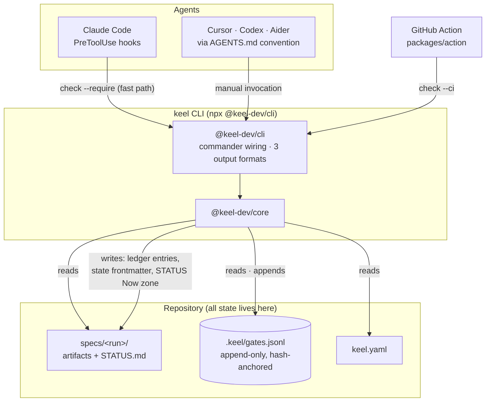
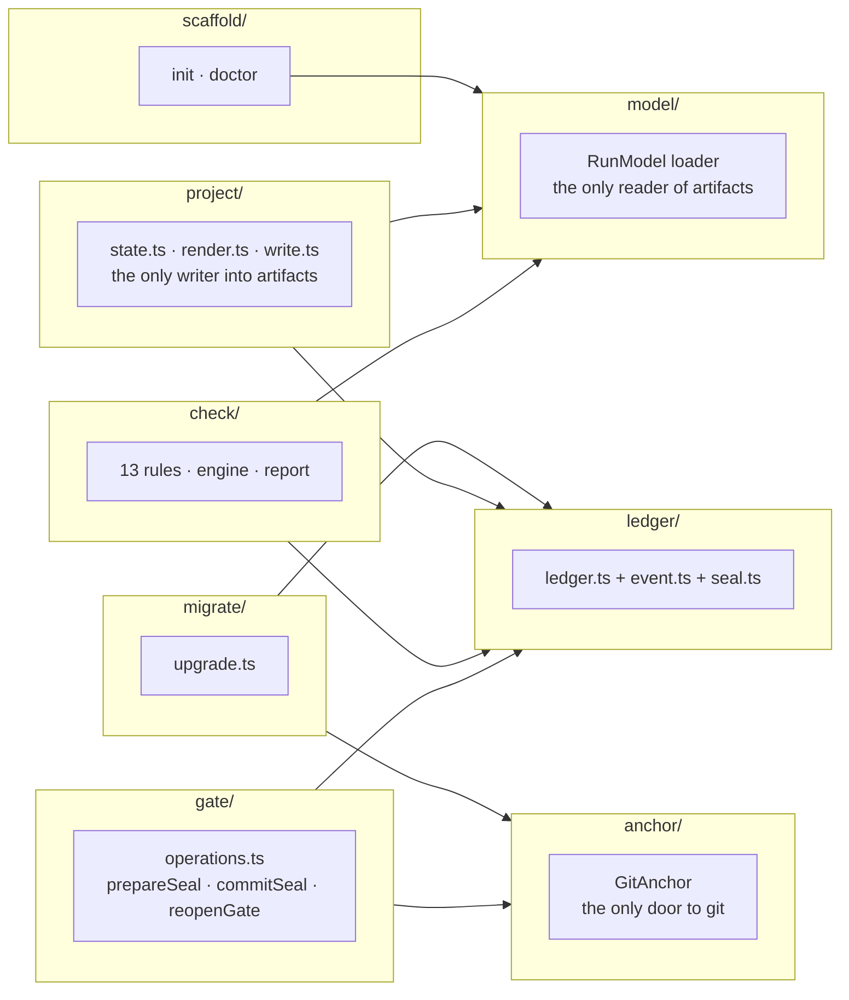

# Keel v2 — Plan of Record

**Status:** Shipped (v2.0.0-alpha) · **Run:** `keel-v2` · **PR:** [#1](https://github.com/sakhujarohan/keel/pull/1)
**Last updated:** 2026-07-21, after the run closed at G6

> This is the run's originating brief, drafted before any code existed, **updated in place to
> reflect what was actually built** rather than kept as a historical curiosity. Where the build
> diverged from the original plan, that's called out explicitly — the divergences are most of what
> makes this worth reading. This file is intentionally outside Keel's recognized artifact set (it
> has no gate frontmatter and the loader never parses it); the actual gated artifacts are
> `requirements.md`, `hld.md`, `stack.md`, and the per-feature LLDs in `features/`.
>
> A styled version of an earlier draft of this document is also hosted as a
> [Claude artifact](https://claude.ai/code/artifact/edafc8be-c3a1-4cb8-a355-e84d99ada5db); this
> file is the current source of truth.

---

## §1 — Thesis

Keel v1 is a complete methodology enforced entirely by prompts: nothing mechanically stops an agent
from designing past an unsigned gate, and a gate sign-off is a sentence in a chat transcript that
evaporates when the session ends. **Keel v2 moves the state machine out of the model and into a
CLI.** The prompts and templates stay — the model still writes every artifact — but a small
TypeScript tool now owns the gate state machine: it validates artifacts, records sign-offs as
git-anchored ledger entries, detects post-sign-off tampering, and exposes all of it as exit codes
that hooks and CI can block on.

**One rule holds everywhere in the implementation:** the CLI verifies; it never authors. The model
writes content; Keel writes state (a ledger entry, or two specific frontmatter fields). That
boundary is mandate M6, and every feature's spec-compliance review checks it explicitly.

The thesis held. **Keel v2 passes its own `keel check` at 0 blocking findings** — the tool that
enforces the lifecycle completed a full run under that lifecycle.

## §2 — What shipped vs. what was planned

| Area | Planned | Shipped |
|---|---|---|
| Rule count | 13 (KC-01…13) | 13, same IDs — but KC-12 and KC-13 both diverged from their literal description (see §5) |
| Packages | `core`, `cli`, adapters | `packages/core`, `packages/cli`, `packages/action` — as planned |
| Gate identity (D3) | Open question | **Resolved:** git identity for v2; verified identity explicitly deferred to a future GitHub App |
| N3 (cold-start latency) | Unknown until the CLI existed | **Measured: ~55 ms** bundled, 9× under the 500 ms budget (§7) |
| Security posture | Not scoped in the original plan | **An ecosystem enhancement:** [`keel-sec-guard`](https://github.com/sakhujarohan/keel-sec-guard), a security auditor built *using Keel v2 itself*, closes path-traversal, ledger-deletion, and CI-annotation-injection gaps (§6) |
| Test count | — | 223, all green |

## §3 — Architecture, as built



`packages/core` internals, matching the shipped module layout:



Two packages, three adapters, no logic in the adapters — a new agent is a hook config, not a code
change.

## §4 — The gate ledger, as built

`.keel/gates.jsonl`, append-only, one JSON line per event:

```jsonl
{"run":"keel-v2","gate":"G1","event":"pass","artifact":"specs/keel-v2/requirements.md","artifact_hash":"7a6938eb…","actor":"Rohan Sakhuja <rohansakhuja.work@gmail.com>","commit":"76e5ceb0…","ts":"2026-07-20T18:39:24.026Z"}
```

Fields: `run, gate, event, artifact, artifact_hash, actor, commit, ts`, plus optional `dirty` /
`legacy` — closed by a zod schema; an entry with any other key is rejected as invalid, which is what
keeps mandate M1's field set from drifting.

**Seal verification is against the working tree, not the last commit** — an uncommitted edit to a
sealed artifact blocks immediately. **Downstream invalidation (`blockedBy`) is derived at read time,
never stored** — restoring an artifact to its sealed bytes heals every downstream gate with zero
cleanup. Per-feature gates (G4, G5) are keyed by `(run, gate, artifact)`, not by a new schema field,
so one feature's broken design never stalls another's — but a **run-level gate (G6) is judged
across every feature's instance**, not blocked merely for not matching one feature (§5, amendment).

### The load-bearing bug: a seal that broke itself

The deepest bug of the build, found only by driving the real CLI end-to-end — no unit test caught
it, because none of them ran the two operations in the same sequence against a real file:

- ADR 0002 says a seal verifies against the **working tree**.
- Mandate A5 says `gate pass` writes `status: signed-off` into the artifact's frontmatter.
- Sealing hashed the artifact *before* that write, then performed the write — which changed the
  file the seal was supposed to protect. **Every gate sealed itself broken.**

**Fix:** `prepareSeal` hashes the artifact **as it will read once signed** — the projected content,
via a shared pure transform (`model/frontmatter-state.ts`) that both the sealer and the projector
call. M1 stays literally true (the stored hash is still `git hash-object` of the bytes that end up
on disk); a seal and its frontmatter projection are now a pair that can never disagree by a byte.

## §5 — The check engine, as built

Severities are fixed in exactly one table: KC-01…KC-09 block, KC-10…KC-13 warn. Two rules diverged
from their one-line description in the original plan, both recorded as deliberate interpretations at
their feature's spec-compliance review rather than silent scope changes:

- **KC-12** was specified as "framework docs self-consistency — phase numbers in `AGENTS.md` match
  the manifest." That's unimplementable in a general repository (a user's repo has no `AGENTS.md`
  phase table). Shipped instead as **template-version drift**: `keel.yaml`'s `templates_version`
  against the installed `templates/VERSION` marker — same failure class, mechanically true anywhere.
- **KC-13** was specified as flagging any commit with no attribution trailer. As first built it
  flagged *every* commit in the repository's history, including everything that predates the run.
  Scoped to **commits that touch a run's artifacts** — `GitAnchor.recentCommits` now returns each
  commit's changed files, and the rule ignores anything outside `specs/<run>/`.
- **KC-09** gained a check not in the original catalog: if `.keel/gates.jsonl` is **missing** in an
  initialized repository that has runs, that is itself a blocking finding ("restore from git
  history"), added during the post-ship security pass (§6) — closing the gap where deleting the
  ledger silently reset every gate to "never sealed" instead of "tampered with."

### The second load-bearing bug: a run-level gate blocked by feature-scoped predecessors

Sealing G6 — the very last gate of the run — immediately surfaced a bug: G6 is run-level and has no
feature, so when the derived `blockedBy` logic checked its per-feature predecessors (G4, G5) it
found no feature-matching seal and concluded they were unsealed, blocking G6 against itself.

**Fix:** a feature-scoped predecessor is now judged two ways. A dependent that belongs to a feature
still cares only about that feature's instance (per-feature independence, unchanged). A run-level
dependent rests on **every** feature's instance being sealed, and never blocks itself merely for
lacking a feature to match against.

## §6 — Security hardening, via a second product built with Keel

Not scoped in the original v2.0 plan — and not a surprise, either. Once the CLI existed, the natural
next thing to build was **[`keel-sec-guard`](https://github.com/sakhujarohan/keel-sec-guard)**, an
AI-based security auditor, runnable locally and as a GitHub Action, *built using Keel v2 itself*.
This is exactly what a working enforcement layer is supposed to enable: a second real project,
developed under the same gated process, from a different problem statement. It was then wired into
this repository as a required check (`.github/workflows/security-audit.yml`) while reviewing PR #1
more rigorously than a read-through alone would catch, and its findings were applied directly:

| Finding | Fix |
|---|---|
| CLI accepted unsanitized paths (`--run`, `--artifact`, `run new <name>`) | `model/paths.ts`'s `assertSafeRepoPath` — every path is resolved and checked to stay inside `repoRoot`; a traversal attempt (`../../etc/passwd`) throws before any read, hash, or write |
| `.keel/gates.jsonl` deletion silently read as "nothing ever sealed" | KC-09 ledger-presence check (§5) |
| GitHub Actions annotation output was injectable | `renderCi` percent-encodes `%`, `\r`, `\n`, `:`, `,` in the `file=`/`title=` properties — a crafted artifact path or rule name can no longer forge extra annotation fields |
| keel-sec-guard correctly surfaced known, deliberate design choices for review | `.secguardignore` documents them as accepted: self-asserted git identity (D3, M9 — verified identity is explicitly v3 scope, not a gap), and the Action's `pull-requests: write` permission (needed to post annotations) |

This is Keel's own "recorded exception" pattern, applied to a tool auditing Keel: a flagged
divergence either gets fixed, or gets a written, human-reviewed reason it's deliberate — never
silently dismissed.

### A third bug, found by writing the README's own quick start

The KC-09 ledger-presence check above (`.keel/gates.jsonl is missing`) shipped with a condition —
"no ledger, but the repo is initialized and has runs" — that could not tell "nothing has been
sealed yet" from "the ledger was deleted after real seals existed." Both look identical: the file
is simply absent. That meant **every brand-new project's first `keel check`** — straight after
`keel init` and `keel run new`, before anyone had sealed anything — tripped a blocking integrity
failure. This surfaced only when this document's own quick-start instructions were verified by
actually running them, rather than trusted from memory.

**Fix:** the check now requires real evidence of a claim with nothing behind it — some artifact's
frontmatter must say `status: signed-off` while no ledger exists to back that claim. A fresh
scaffold has nothing at `signed-off` yet (a new `context.md` is `status: set`), so it passes cleanly;
an artifact that legitimately was sealed and then had its ledger entry erased still carries
`signed-off` in its frontmatter (written by the projection at seal time), so the real bypass this
check was built for is still caught. Two regression tests pin both directions.

## §7 — Evidence

- **225 tests**, all passing (`npm run check` = Biome + typecheck + vitest across all packages).
- **`keel check` on this repository: 0 blocking findings**, 6 warnings — all six are `KC-13` on
  maintainer chore-commits (gate reseals) made without the attribution hook installed; honest and
  documented, not suppressed.
- **N3 resolved.** Bundled hook path (`node` + esbuild bundle) cold-starts at **~55 ms**, roughly 9×
  under the 500 ms budget. The ~750 ms figure that looked alarming mid-build was `tsx` compiling
  TypeScript on the fly in dev — not the artifact a user runs. ADR 0001's escape hatch (a compiled
  fast path) is **not needed**.
- **`keel upgrade` proven on the real shipped example:** `examples/ticket-booking` migrates with
  zero manual edits — 12 artifacts bumped to schema v2, 9 gates backfilled as `legacy: true`, and
  `keel check` reports no seal break afterward. This is R13's acceptance test, run against the
  actual example rather than a synthetic fixture.

## §8 — Decisions record (D1–D6), final state

All resolved; none remain open.

| ID | Decision | Status |
|----|----------|--------|
| D1 | Keep the name "Keel"; coexist with keel.sh | Decided |
| D2 | One repo-level `.keel/gates.jsonl` ledger, keyed by run | Decided, shipped |
| D3 | Git identity for the ledger's `actor` field in v2 | **Decided** (delegated to the agent, conditioned on a v3 GitHub App delivering verified identities — not yet built; `.secguardignore` records this as a deliberate, not overlooked, trade-off) |
| D4 | `keel gate pass` requires a clean tree by default; `--allow-dirty` stamps `dirty: true` | Decided, shipped |
| D5 | Telemetry off by default; full design deferred | Decided — telemetry remains unbuilt, v2.1 scope |
| D6 | Agent attribution via git commit trailers, omit-never-invent | Decided, shipped — and its own hook needed a fix mid-build (an early version returned non-zero on an empty trailer value, which would have silently aborted every human commit; caught by `hook.test.ts`) |

## §9 — Roadmap

1. **v2.0.0 (non-alpha):** wire `tsup` for `packages/cli`, claim the `@keel-dev` npm scope, publish.
   Neither is done yet — today the CLI runs from a clone via `npx tsx packages/cli/src/main.ts`, not
   a published `npx @keel-dev/cli`.
2. **v2.0.x:** the ten-item patch list in
   [`review-checklist.md`](./review-checklist.md#known-limitations--v20x-candidates) — each a
   documented, deliberate deferral with its trigger condition, not a hidden gap.
3. **v2.1:** telemetry (D5) and the brownfield `keel survey` — both out of this run's locked scope
   (assumption A1).

## §10 — Where the formal record lives

This document is a narrative summary. The gated, spec-compliance-checked artifacts are the source of
truth for any specific claim above:

- `requirements.md` — R1–R14, N1–N7, Literal Mandates M1–M9
- `hld.md`, `stack.md` — shape and tooling
- `features/*/lld.md` + `spec-check.md` — per-feature design and mandate verification, including
  every amendment referenced in §4–§5
- `review-checklist.md` — the G6 ship review: Traceability & Spec-Compliance ledgers, measured
  performance, known limitations
- `decisions/0001-*.md`, `decisions/0002-*.md` — the two ADRs, both updated to reflect the ledger
  behavior as it finally shipped
- `STATUS.md` — the session-by-session captain's log
