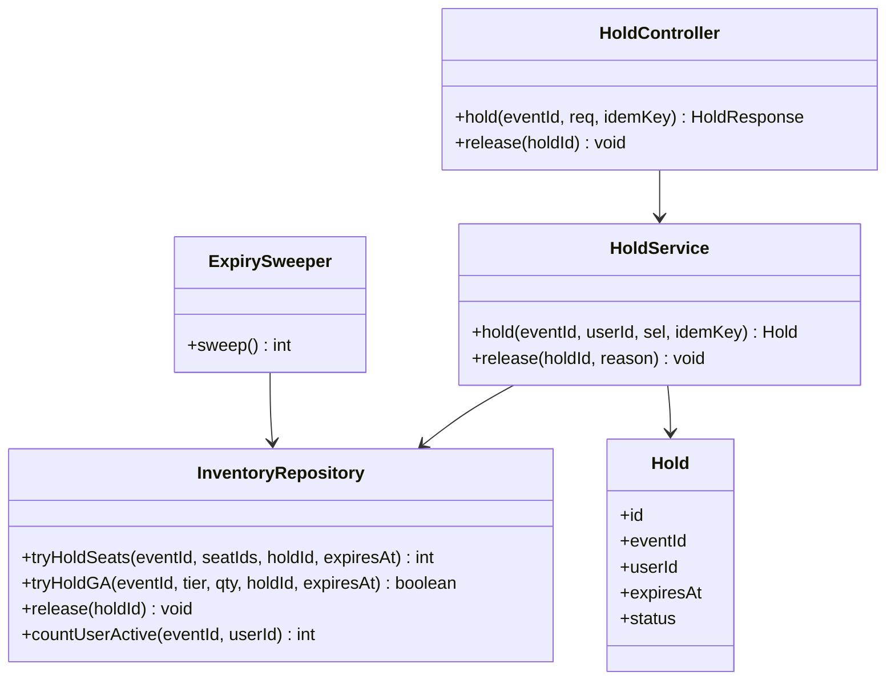

# LLD — seat-hold

**Status:** [SIMULATED] G4 · **Run:** ticket-booking-v2 · **Stack:** Java/Spring + Postgres + Redis (see `../../stack.md`)
**Serves requirements:** R4, R5, R7, R8, N1, N4

> **Diagrams:** Mermaid default; `plantuml` via the Kroki toolchain (`tools/diagrams.md`).

## Class / Type Design



## Interfaces / Contracts

```
POST /events/{eventId}/holds
  header: Idempotency-Key
  body: { "seatIds": ["A12","A13"] }      // reserved
      | { "tier": "GA", "quantity": 2 }   // general admission
  → 201 { "holdId", "expiresAt", "items": [...] }
  → 409 { "error": "seat(s) unavailable", "unavailable": ["A12"] }
  → 409 { "error": "purchase limit reached" }
  → 404 { "error": "event not found" }

DELETE /holds/{holdId}   → 204   (idempotent release)
```

## Concrete Data Model

- `seats(event_id, seat_id, price_tier)` — PK `(event_id, seat_id)`
- `holds(id, event_id, user_id, expires_at, status, idem_key, created_at)` — `status ∈ {active, released, converted}`
- `hold_seats(hold_id, event_id, seat_id, released_at NULL)`
  — **`UNIQUE(event_id, seat_id) WHERE released_at IS NULL`** ← the no-double-hold guard
- `ga_inventory(event_id, tier, capacity, remaining)` — PK `(event_id, tier)`
- `user_event_counter(event_id, user_id, count)` — purchase-limit tracking
- Idempotency: `UNIQUE(idem_key)` on `holds`.

## Error Model

| Failure | Trigger | Result | Tx behavior |
|---------|---------|--------|-------------|
| seat already held/sold | partial-UNIQUE violation on `hold_seats` | 409 + which seats | whole hold rolls back (all-or-nothing) |
| GA sold out | guarded decrement affects 0 rows | 409 | rollback |
| purchase limit | counter ≥ limit | 409 | rollback |
| duplicate idem-key | `UNIQUE(idem_key)` hit | return the original hold | no new hold |
| event missing | no row | 404 | no write |

## Concurrency / Consistency

- **Reserved:** each seat is inserted into `hold_seats` under the **partial UNIQUE active-hold index** — concurrent holds for the same seat → exactly one wins, the rest get a unique violation → 409. The hold is **all-or-nothing** (one transaction; losing any seat rolls back the batch). Satisfies **N1**, R5.
- **GA:** `UPDATE ga_inventory SET remaining = remaining - :q WHERE remaining >= :q` — affects 0 rows when insufficient → 409; `remaining` never goes negative. Satisfies **N1**.
- **Expiry:** `expires_at` on the hold; the **sweeper** sets `released_at`; availability reads ignore holds past `expires_at`. Crash-safe (data, not an in-memory timer). Satisfies **N4**, R7.
- **Purchase limit** enforced in the same transaction via `user_event_counter`. Satisfies R8.

## G4 — LLD Sign-off
- [x] One-Line Test: a builder could implement this from this doc alone
- [x] Types/contracts trace to R4/R5/R7/R8/N1/N4
- [x] Error model covers every failure mode
- [x] The no-oversell invariant is explicitly satisfied
- [x] [SIMULATED] human confirmed
