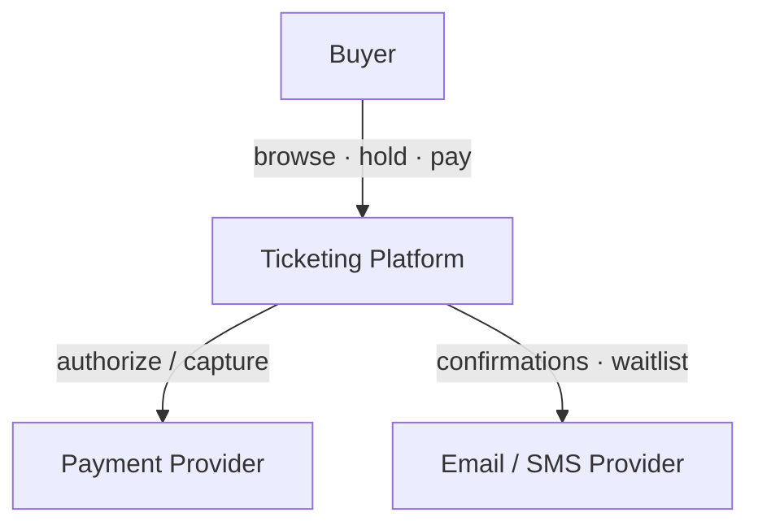
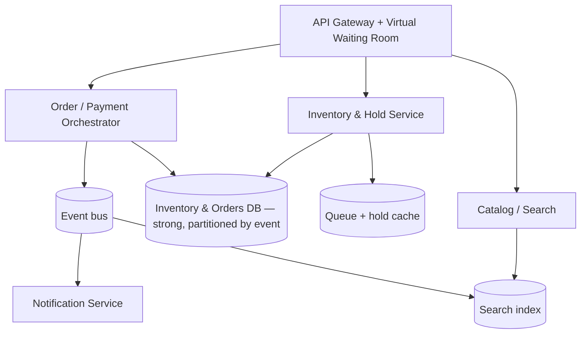
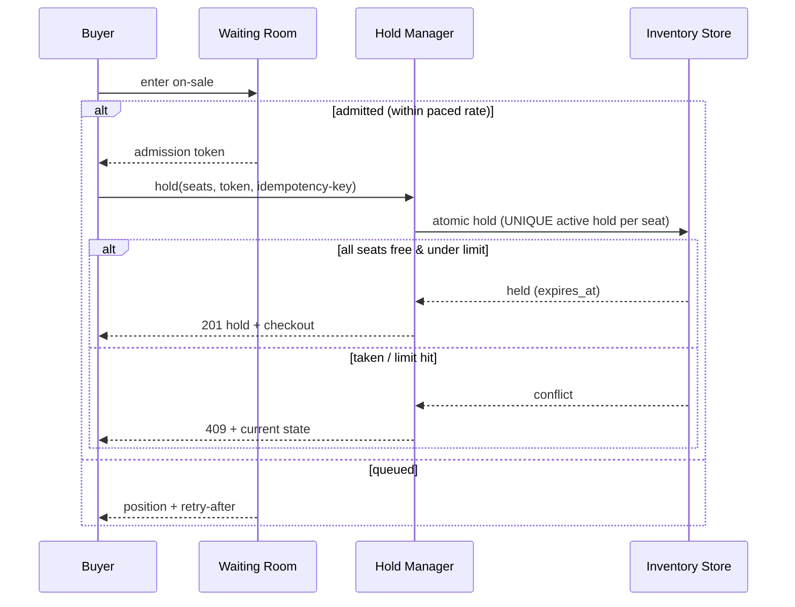
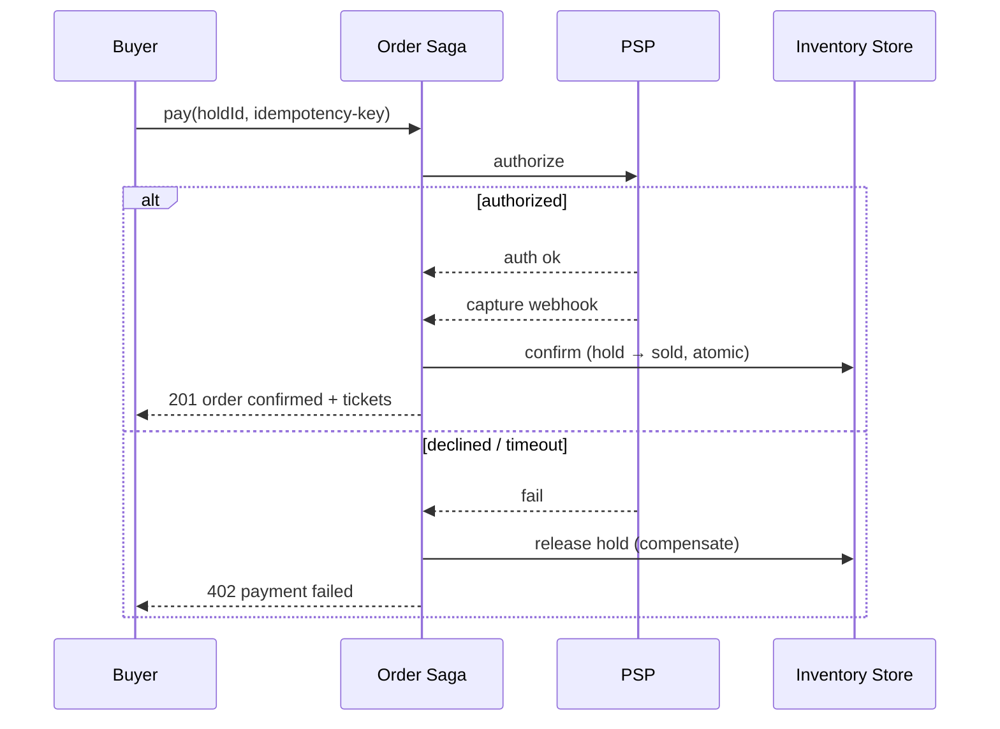
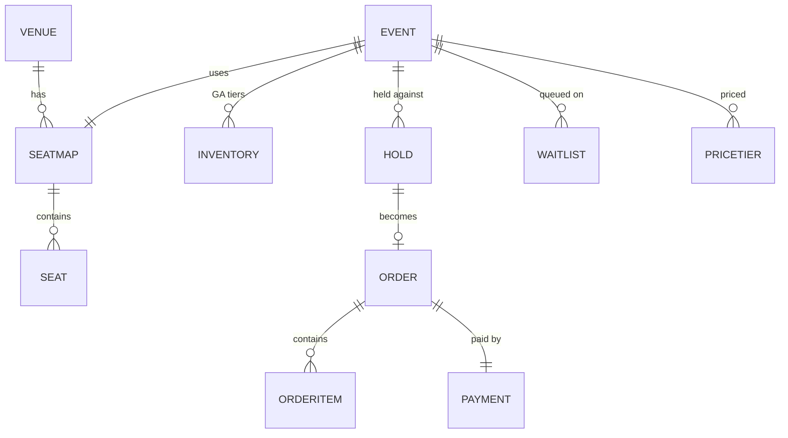

# High-Level Design — ticket-booking-v2

**Status:** LOCKED ([SIMULATED] G2) · **Requirements:** see `requirements.md`

## Critical Design Questions

### Q1 — How do we guarantee NO overselling under ~50k concurrent buyers for one event? (N1, N2, R4/R5)
The hot-event inventory row is a contention magnet — naive locking serializes the whole sale and collapses latency.
- **Options:**
  - (a) Pessimistic row lock per seat/event (`SELECT … FOR UPDATE`) — correct but a hot-row bottleneck; throughput tanks.
  - (b) Optimistic CAS on availability + app retry — retry storms under extreme contention.
  - (c) **Two layers:** a **virtual waiting room** that admits a paced number of buyers (shedding load *before* it reaches inventory) **+** an **atomic per-seat hold** the datastore arbitrates — a `UNIQUE(event_id, seat_id)` active-hold constraint for reserved seats, and an atomic guarded decrement for GA capacity.
- **Decision:** (c). The waiting room caps concurrency to what the core can serve; the per-seat atomic op makes the *invariant* impossible to violate regardless. Inventory is **partitioned by event**, so one hot event can't starve others. (→ ADR `0001`)
- **Why:** correctness is enforced by the store (not by app coordination), and load is shaped before it reaches the contended resource.

### Q2 — How do holds expire reliably and release inventory, even across crashes? (N4, R7)
- **Options:** lazy expiry on next read · a periodic sweeper · durable per-hold timers.
- **Decision:** holds carry `expires_at`; a **sweeper** releases expired holds, **and** every availability read treats an expired hold as released (lazy belt-and-braces). Release atomically returns inventory. Survives crashes because expiry is *data* (`expires_at`), not an in-memory timer.

### Q3 — How does checkout → payment → confirm stay consistent across a slow/failing external PSP? (N7, N8, R6/R7/R10)
- **Options:** synchronous charge in-request · an **order saga** (orchestrated) with idempotency + compensation.
- **Decision:** an **order saga** — `hold → authorize (sync) → await capture webhook → confirm + issue` — with **idempotency keys** on every step and **compensation** (release hold, void authorization) on failure/timeout. Confirmation is exactly-once. (→ ADR `0002`)

### Q4 — Consistency boundaries (N5, N6)
Inventory, holds, and orders are **strongly consistent** (one partition per event). Catalog/search and notifications are **eventually consistent** (read replicas / async) — so browse stays up even while checkout is paced.

> **Diagrams:** inline Mermaid below is the zero-dep default; with the Kroki toolchain (`tools/diagrams.md`) these become validated `c4plantuml` / `plantuml` / `erd` SVGs under the run's `diagrams/`.

## C4 Level 1 — System Context

## C4 Level 2 — Containers

## C4 Level 3 — Components (Inventory & Hold + Order orchestrator)

| Component | Responsibility | Serves |
|-----------|----------------|--------|
| Waiting Room | Pace/admit buyers; issue time-boxed tokens | R3, N2, N6 |
| Hold Manager | Atomic seat/GA hold + release; enforce purchase limit | R4, R5, R7, R8, N1 |
| Expiry Sweeper | Release expired holds | R7, N4 |
| Inventory Store | Seat & GA state per event (partitioned) | N1, N5 |
| Order Saga | hold→authorize→capture→confirm; compensation | R6, R7, R10, N8 |
| Payment Adapter | PSP authorize/capture + idempotent webhook intake | R6, N8 |
| Waitlist | Join + notify on release | R9 |

## Key Flow — On-sale hold

## Key Flow — Checkout saga (pay → confirm, with compensation)

## Conceptual Data Model

## Feature List (→ Phase 4 iterates these)

| Feature | Delivers | LLD |
|---------|----------|-----|
| catalog-search | R1, R2 | `features/catalog-search/lld.md` |
| waiting-room | R3, N2, N6 | `features/waiting-room/lld.md` |
| **seat-hold** (crux) | R4, R5, R7, R8, N1, N4 | `features/seat-hold/lld.md` |
| checkout-saga | R6, R7, R10, N8 | `features/checkout-saga/lld.md` |
| waitlist | R9, R11 | `features/waitlist/lld.md` |
| refunds | R12 | `features/refunds/lld.md` |

## G2 — HLD Sign-off
- [x] Every requirement served by a component (feature list traces R-IDs)
- [x] The four critical design questions answered with rationale (→ ADRs 0001, 0002)
- [x] Diagrams mutually consistent
- [x] [SIMULATED] human confirmed the shape before stack selection
