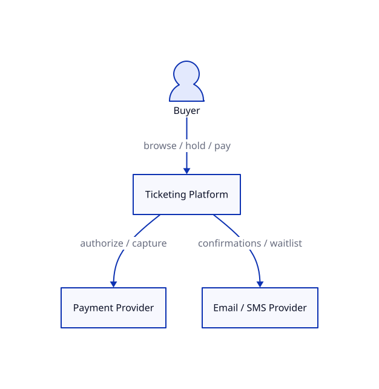
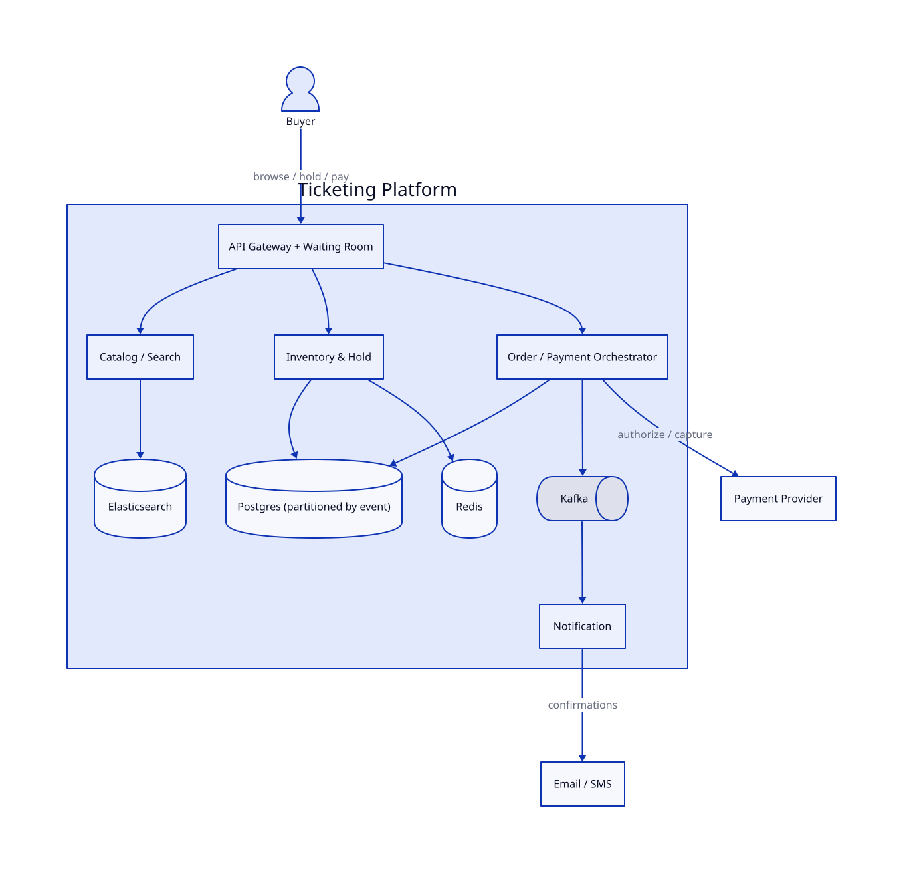
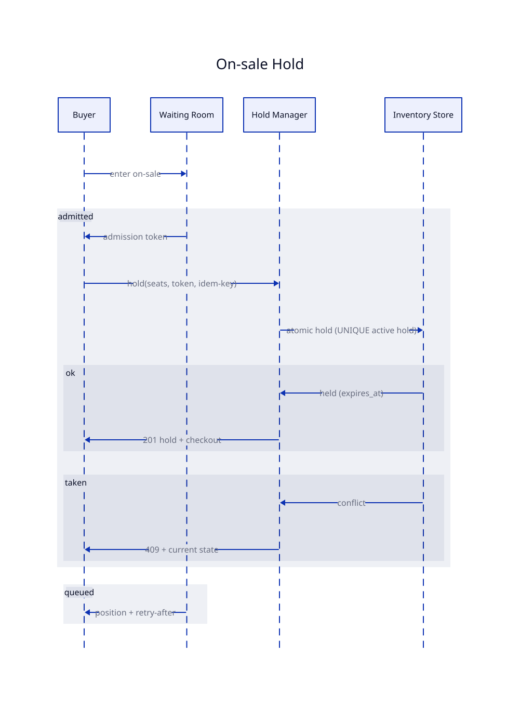
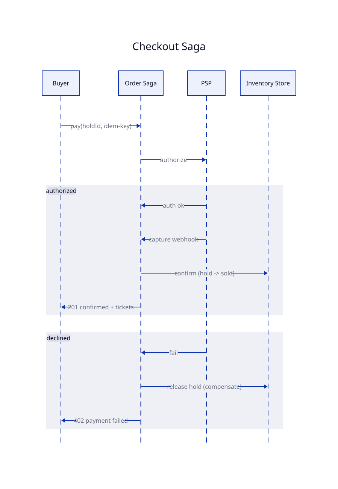
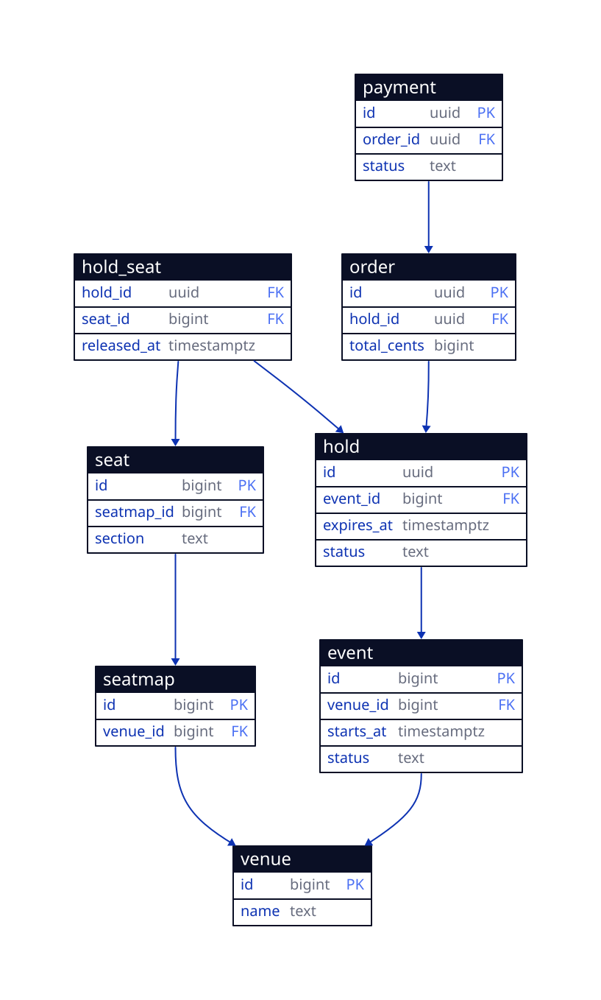

# High-Level Design — ticket-booking-v3

**Status:** LOCKED ([SIMULATED] G2) · Requirements: see `requirements.md` · diagrams rendered via Kroki (`tools/diagrams.md`)

## In one paragraph

A buyer browses events and, when an on-sale opens, passes through a **virtual waiting room** that lets only a safe number of people through at once. An admitted buyer **holds** specific seats (or a quantity of general-admission tickets) for ten minutes; the hold is what guarantees no two buyers ever get the same seat. They then pay through an external provider, and on success the order is **confirmed** and tickets issued. If they don't pay in time — or payment fails — the hold **expires** and the inventory goes back on sale. Inventory and orders are kept strongly consistent; browse, search, and notifications can lag a little.

## Critical design questions

### Q1 — How do we never oversell when 50,000 people hit one event at once?
The inventory for a hot event is a single point of contention. Two ideas combine to solve it:
- A **virtual waiting room** admits buyers at a paced rate, so the core only ever sees a load it can serve — load is shed *before* it reaches inventory.
- The hold itself is **atomic and arbitrated by the database**: a reserved seat can have only one active hold (a uniqueness rule), and general admission decrements a counter that can't go below zero.

Inventory is **partitioned per event**, so one hot event can't starve the rest. Correctness comes from the database rule (not application coordination), and throughput comes from shaping load first. → **ADR 0001**.

### Q2 — How do holds expire reliably, even if a process crashes?
Each hold stores an **`expires_at`** timestamp. A sweeper releases expired holds, and — as a backstop — any availability check treats a hold past its expiry as already released. Because expiry is *data*, not an in-memory timer, a crash can't leak a hold forever.

### Q3 — How does checkout stay correct across a slow or failing payment provider?
Checkout runs as an **order saga**: hold → authorize → (await capture webhook) → confirm + issue. Every step is **idempotent**, and on decline or timeout the saga **compensates** by releasing the hold and voiding the authorization. So a retry never double-charges and a failure never strands inventory. → **ADR 0002**.

### Q4 — Where do we need strong consistency, and where can we relax it?
Inventory, holds, and orders are **strongly consistent** (one partition per event). The event catalog/search and notifications are **eventually consistent**, so browsing stays fast and available even while checkout is being paced.

## System context



<details><summary>diagram source (d2)</summary>

```d2
buyer: Buyer {shape: person}
platform: Ticketing Platform
psp: Payment Provider
notif: Email / SMS Provider
buyer -> platform: browse / hold / pay
platform -> psp: authorize / capture
platform -> notif: confirmations / waitlist
```
</details>

## Containers



<details><summary>diagram source (d2)</summary>

```d2
buyer: Buyer {shape: person}
platform: Ticketing Platform {
  gw: API Gateway + Waiting Room
  cat: Catalog / Search
  inv: Inventory & Hold
  ord: Order / Payment Orchestrator
  notif: Notification
  db: Postgres (partitioned by event) {shape: cylinder}
  cache: Redis {shape: cylinder}
  search: Elasticsearch {shape: cylinder}
  bus: Kafka {shape: queue}
  gw -> cat ; gw -> inv ; gw -> ord
  cat -> search ; inv -> db ; inv -> cache
  ord -> db ; ord -> bus ; bus -> notif
}
psp: Payment Provider
sms: Email / SMS
buyer -> platform.gw: browse / hold / pay
platform.ord -> psp: authorize / capture
platform.notif -> sms: confirmations
```
</details>

| Container | What it owns | Key requirements |
|-----------|--------------|------------------|
| API Gateway + Waiting Room | Paces on-sale load; issues time-boxed admission tokens | R3 |
| Catalog / Search | Browse and search events; seat-map reads | R1, R2 |
| Inventory & Hold | Atomic seat/GA holds, release, purchase limits, expiry | R4, R5, R7, R8 |
| Order / Payment Orchestrator | The checkout saga and PSP integration | R6, R7, R10 |
| Notification | Confirmations and waitlist alerts | R9, R11 |

## Key flow — placing a hold during the on-sale



<details><summary>diagram source (d2)</summary>

```d2
hold: On-sale Hold {
  shape: sequence_diagram
  buyer: Buyer ; q: Waiting Room ; h: Hold Manager ; d: Inventory Store
  buyer -> q: enter on-sale
  admitted: {
    q -> buyer: admission token
    buyer -> h: hold(seats, token, idem-key)
    h -> d: atomic hold (UNIQUE active hold)
    ok: { d -> h: held (expires_at) ; h -> buyer: 201 hold + checkout }
    taken: { d -> h: conflict ; h -> buyer: 409 + current state }
  }
  queued: { q -> buyer: position + retry-after }
}
```
</details>

## Key flow — checkout saga



<details><summary>diagram source (d2)</summary>

```d2
checkout: Checkout Saga {
  shape: sequence_diagram
  buyer: Buyer ; o: Order Saga ; p: PSP ; d: Inventory Store
  buyer -> o: pay(holdId, idem-key)
  o -> p: authorize
  authorized: {
    p -> o: auth ok ; p -> o: capture webhook
    o -> d: confirm (hold -> sold) ; o -> buyer: 201 confirmed + tickets
  }
  declined: {
    p -> o: fail ; o -> d: release hold (compensate) ; o -> buyer: 402 payment failed
  }
}
```
</details>

## Data model

How the data is stored. Concrete column types and indexes are in each feature's LLD; this is the entity-level picture.

| Entity | Key fields | Relationships |
|--------|-----------|---------------|
| **Venue** | id, name | has many SeatMaps and Events |
| **SeatMap** | id, venue_id | belongs to a Venue; has many Seats |
| **Seat** | id, seatmap_id, section, row, number | belongs to a SeatMap |
| **Event** | id, venue_id, seatmap_id, starts_at, status | priced by PriceTiers; has GA inventory |
| **PriceTier** | id, event_id, price_cents | belongs to an Event |
| **GAInventory** | id, event_id, tier_id, capacity, remaining | per-event general-admission counter |
| **Hold** | id, event_id, user_id, status, expires_at, idem_key | has many HoldSeats; becomes one Order |
| **HoldSeat** | id, hold_id, event_id, seat_id, released_at | one active hold per seat (uniqueness rule) |
| **Order** | id, hold_id, user_id, status, total_cents | paid by one Payment |
| **Payment** | id, order_id, psp_ref, status | belongs to an Order |
| **Waitlist** | id, event_id, user_id, created_at | per-event waitlist entries |



<details><summary>diagram source (d2 — shape: sql_table)</summary>

```d2
venue: { shape: sql_table; id: bigint {constraint: primary_key}; name: text }
seatmap: { shape: sql_table; id: bigint {constraint: primary_key}; venue_id: bigint {constraint: foreign_key} }
seat: { shape: sql_table; id: bigint {constraint: primary_key}; seatmap_id: bigint {constraint: foreign_key} }
event: { shape: sql_table; id: bigint {constraint: primary_key}; venue_id: bigint {constraint: foreign_key}; status: text }
hold: { shape: sql_table; id: uuid {constraint: primary_key}; event_id: bigint {constraint: foreign_key}; status: text }
hold_seat: { shape: sql_table; hold_id: uuid {constraint: foreign_key}; seat_id: bigint {constraint: foreign_key} }
order: { shape: sql_table; id: uuid {constraint: primary_key}; hold_id: uuid {constraint: foreign_key} }
payment: { shape: sql_table; id: uuid {constraint: primary_key}; order_id: uuid {constraint: foreign_key} }
seatmap.venue_id -> venue.id ; seat.seatmap_id -> seatmap.id ; event.venue_id -> venue.id
hold.event_id -> event.id ; hold_seat.hold_id -> hold.id ; hold_seat.seat_id -> seat.id
order.hold_id -> hold.id ; payment.order_id -> order.id
```
</details>

## Feature list

The features Phase 4 designs. The three on the critical path are designed in depth; the rest are complete but lighter.

| Feature | What it delivers | Depth | LLD |
|---------|------------------|-------|-----|
| catalog-search | Browse/search events; seat-map reads | lighter | `features/catalog-search/lld.md` |
| **waiting-room** | Paced admission with tokens | core | `features/waiting-room/lld.md` |
| **seat-hold** | Atomic no-oversell hold + expiry + limits | core | `features/seat-hold/lld.md` |
| **checkout-saga** | Pay → confirm with compensation | core | `features/checkout-saga/lld.md` |
| waitlist | Join + notify on release | lighter | `features/waitlist/lld.md` |
| refunds | Cancel + refund + release | lighter | `features/refunds/lld.md` |

## G2 — HLD Sign-off
- [x] Every requirement is owned by a container, and every feature traces to requirements
- [x] The four critical questions are answered, with the load-bearing two captured as ADRs
- [x] Diagrams render (SVGs in `diagrams/`) and agree with each other
- [x] [SIMULATED] human confirmed the shape before stack selection
