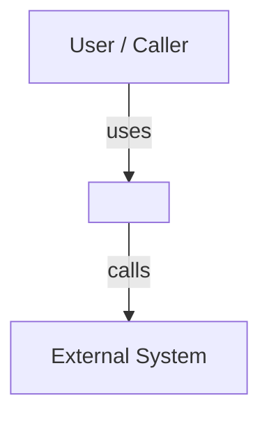
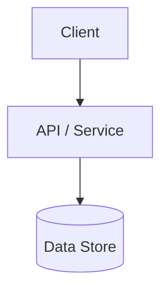
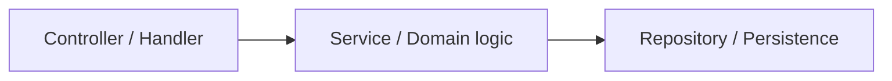
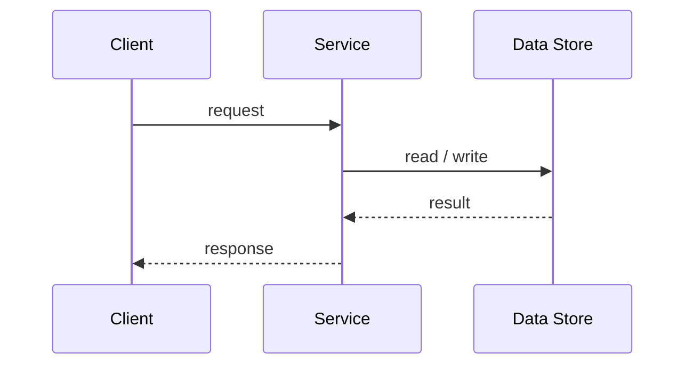
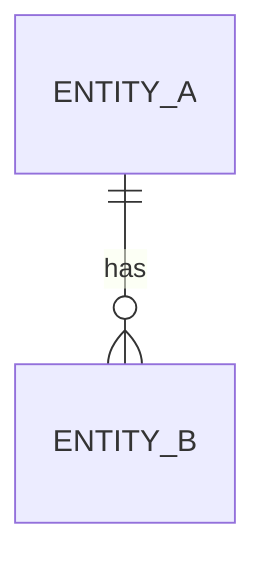

<!--
TEMPLATE: High-Level Design (Phase 2). Copy to specs/<run>/hld.md and fill in.
Decide SHAPE and RESPONSIBILITIES here — not the stack (Phase 3) and not class detail (Phase 4).
Diagrams use Mermaid so they render on GitHub and are agent-readable. Delete these comments as you go.
-->

# High-Level Design — <run>

**Status:** DRAFT → (LOCKED after G2) · **Requirements:** see `requirements.md`

---

## Critical Design Questions

<!--
The 1–3 decisions that dominate this architecture. For each: the question, the options, the answer, and why.
These are the questions a reviewer will push on. Answer them before drawing boxes.
-->

### Q1 — <the dominant question, e.g. "how do concurrent operations stay correct?">
- **Options:** <A vs B>
- **Decision:** <chosen>
- **Why:** <trade-off; which NFR drives it> (→ may become an ADR in Phase 3)

---

> **Right-size the C4 levels:** include the levels that add information; collapse adjacent levels when one would just duplicate another (a small service often merges Container + Component into one diagram). On the fast path, one component sketch + one sequence diagram is enough.

## C4 Level 1 — System Context

<!-- The system as one box: who/what uses it and which external systems it talks to. -->

## C4 Level 2 — Containers

<!-- The runnable/deployable pieces and the data stores. -->

## C4 Level 3 — Components

<!-- Major internal components and their responsibilities. -->

| Component | Responsibility | Serves requirements |
|-----------|----------------|---------------------|
| <Controller> | <what it does> | R1, R2 |
| <Service> | | |
| <Repository> | | |

## Key Flows (sequence diagrams)

<!-- The critical end-to-end flows, especially the ones the critical questions touch. -->

## Conceptual Data Model

<!-- Entities and relationships only. No column types or indexes yet (that's Phase 4). -->

---

## Feature List

<!-- The features the LLD phase (Phase 4) will iterate, each traced to the requirements it delivers. This is the bridge from HLD to per-feature LLD. -->

| Feature | Delivers | LLD |
|---------|----------|-----|
| <feature-a> | R1, R2 | `features/<feature-a>/lld.md` |
| <feature-b> | R3 | `features/<feature-b>/lld.md` |

## G2 — HLD Sign-off

- [ ] Every requirement is served by at least one component (traceability holds)
- [ ] Critical design questions are answered with rationale
- [ ] Diagrams are mutually consistent and render
- [ ] **Human has confirmed the shape before stack selection**
