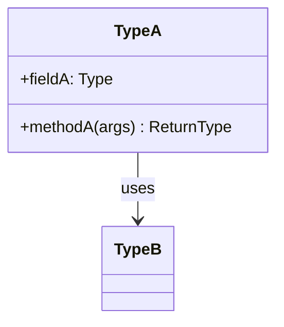

<!--
TEMPLATE: Low-Level Design (Phase 4, per feature). Copy to specs/<run>/features/<feature>/lld.md.
Goal: enough detail that implementation is mechanical. Apply the One-Line Test — could a builder agent
implement this feature from this document alone? If not, it's underspecified. Delete comments as you go.
-->

# LLD — <feature>

**Status:** DRAFT → (signed off after G4) · **Run:** <run> · **Stack:** see `../../stack.md`
**Serves requirements:** R<x>, R<y>

---

## Class / Type Design

> **Diagrams:** Mermaid below is the zero-dep default. With the Kroki toolchain (see `tools/diagrams.md`), generate `plantuml` class + `dbml`/`erd` SVGs into the run's `diagrams/` instead (SVG + source in `<details>`).



| Type | Responsibility | Serves requirements |
|------|----------------|---------------------|
| <TypeA> | <what it owns> | R<x> |

## Interfaces / Contracts

<!-- Public surface: method signatures, API endpoints, message shapes. Be exact — these are what callers depend on. -->

```
<e.g. POST /resource  body: {...}  → 201 {...} | 4xx {...}>
<e.g. interface Foo { Result doThing(Input in) }>
```

## Concrete Data Model

<!-- Now the real thing: tables/collections, fields, types, keys, indexes, constraints. -->

| Field | Type | Constraints / notes |
|-------|------|---------------------|
| id | <type> | PK |
| | | |

Indexes: <which, and why>
Invariants: <what must always hold>

## Error Model

<!-- Every failure mode: what triggers it, what it returns/raises, and the transaction/rollback behavior. -->

| Failure | Trigger | Result | Transaction behavior |
|---------|---------|--------|----------------------|
| <e.g. insufficient balance> | <validation fails> | <422 + message> | <rollback, nothing persisted> |

## Concurrency / Consistency Notes

<!-- If N-requirements involve concurrency or consistency, state exactly how this design satisfies them. -->

- <e.g. row-level lock on X serializes concurrent writers; satisfies N1>

---

## G4 — LLD Sign-off

- [ ] One-Line Test passes: a builder could implement this from this doc alone
- [ ] Every type/contract traces to a requirement
- [ ] Error model covers every failure mode
- [ ] Concurrency/consistency requirements are explicitly satisfied
- [ ] **Human has confirmed the design before build**
